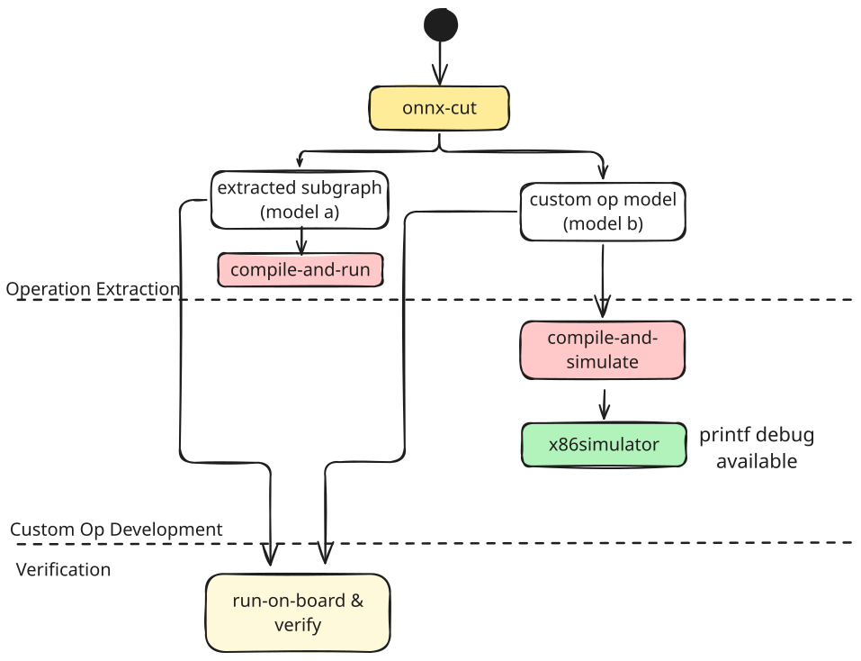

<!--- Copyright (C) 2026 Advanced Micro Devices, Inc. All rights reserved.--->
# Custom Ops Flow

## Table of Contents

- [Introduction](#introduction)
  - [Several useful resources](#several-useful-resources)
- [Using Custom Ops](#using-custom-ops)
  - [Vitis AI Config](#vitis-ai-config)
  - [Custom Op Config](#custom-op-config)
    - [Tiling and kernel](#tiling-and-kernel)
    - [Matching an unmodified model with PDLL](#matching-an-unmodified-model-with-pdll)
    - [Heap and stack size](#heap-and-stack-size)
    - [Kernel signature declaration](#kernel-signature-declaration)
      - [Floating-point data types](#floating-point-data-types)
    - [Data layout specification](#data-layout-specification)
      - [Automatic padding for vectorization](#automatic-padding-for-vectorization)
      - [Reducing layout discrepancies](#reducing-layout-discrepancies)
  - [Using Custom Ops with ONNX Runtime](#using-custom-ops-with-onnx-runtime)
- [Developing Custom Ops](#developing-custom-ops)
  - [Subgraph extraction](#subgraph-extraction)
  - [Custom Op Development](#custom-op-development)
    - [Debugging Tiling](#debugging-tiling)
    - [Board](#board)
  - [Kernel Code](#kernel-code)
- [Appendix](#appendix)
  - [CustomOp execution and debugging flags](#customop-execution-and-debugging-flags)
  - [ADF header](#adf-header)
  - [Determining the stack and heap size](#determining-the-stack-and-heap-size)

---

## Introduction

The Custom Ops Flow is a methodology for extending VAIML to support user-defined operations.
Unlike the traditional flow, which relies on a fixed set of pre-built kernels, the Custom Ops Flow gives you the flexibility to define your own kernel, tailored to your specific application needs and performance goals.

This approach is designed for users with some experience in AIE hardware and programming.
It provides you with more control over the logic and integration of your operator, while still maintaining a layer of abstraction from the hardware.
This lets you focus on your operator’s functionality, while ensuring compatibility with the VAIML framework and overlay constraints.

Custom Ops Flow is especially useful when:
- You need an ONNX operation that VAIML does not natively support.
- Your application has performance requirements that call for a more specialized implementation than what VAIML currently supports.

To implement a custom operator, you’ll need several key components:

[**Custom Op Config**](#custom-op-config)
  > Configuration file that specifies, e.g., the paths to all files that are required to make a custom op usable within VAIML.
  > This file acts as the central reference for your custom op and ensures all resources are available during compilation.

[**AIE Kernel Implementation**](#kernel-code)
  > Defines the computation for your operator.
  > This kernel runs on the AIE hardware and should be designed to efficiently process your input tensors.

[**Tiling**](tiling.md)
  > Describes how your tensors are partitioned and mapped onto the AIE hardware.
  > The tiler defines the data movement and tiling strategy, which is important for achieving good performance.

Each component plays a specific role in the compilation and execution process.
The config ties everything together, the tiler manages data movement, the kernel performs the computation, and the header handles integration with the AIE overlay and memory.
Further details and guidance is provided for each step/component below.

---

### Several useful resources:

- [Custom Op Usage Examples](tutorial/README.md)
- [RyzenAI Docs](https://ryzenai.docs.amd.com/en/latest/)
- [AI Engine Documentation Landing page](https://docs.amd.com/p/ug1720-ai-engine-landing)
- [AIE-ML Architecture user guide](https://docs.amd.com/r/en-US/am020-versal-aie-ml/AIE-ML-Array-Overview)
- [AIE Kernel & Graph programming user guide](https://docs.amd.com/r/en-US/ug1079-ai-engine-kernel-coding/Overview?tocId=_gsmjbSrB9YCl4WkKcFCww)
- [Vitis AIE Development Tutorials](https://github.com/Xilinx/Vitis-Tutorials/tree/2025.1/AI_Engine_Development/AIE-ML)

## Using Custom Ops

This section describes how to configure and use custom ops within the VAIML framework.

### Vitis AI Config

Onnx models are compiled for AIE by using onnxruntime with the [VitisAIExecutionProvider](https://ryzenai.docs.amd.com/en/latest/modelrun.html).
The Vitis AI Config provides settings for the VitisAIExecutionProvider.
One part of this is the configuration for VAIML, which includes the Custom Ops flow.

The following section describes the custom ops:
```json
"custom_ops": {
    "<custom_op_name>": {
      "op_config": "<custom_op_config>"
    }
}
```

The first part, `<custom_op_name>`, is the name of the custom op as it appears in your onnx model.

> Note: Parts in `<>` need to be replaced by actual values.

You can have multiple custom ops; add one entry per op you want to register.
Find all details on the `<custom_op_config>` in the [Custom Op Config Section](#custom-op-config).

A full Vitis AI Config (`vitisai_config.json`) including the custom ops section looks like this:
```json
{
  "passes": [
    {
      "name": "vaiml_partition2",
      "plugin": "vaip-pass_vaiml_partition",
      "vaiml_config": {
        "keep_outputs": true,
        "optimize_level": 2,
        "enable_f32_to_bf16_conversion": true,
        "logging_level": "info",
        "fe_args": "small-tensor-threshold-unwrapping=0",
        "experiment_features": [
          "KeepOrphanNodes"
        ],
        "custom_ops": {
          "mydomain.myop": {
            "op_config": "my_custom_op.yaml"
          }
        }
      }
    }
  ],
  "target": "VAIML",
  "targets": [
    {
      "name": "VAIML",
      "pass": [
        "vaiml_partition2"
      ]
    }
  ]
}
```

Find the full documentation on the Vitis AI Execution Provider Options [here](https://ryzenai.docs.amd.com/en/latest/modelrun.html#vitisai-ep-provider-options).

### Custom Op Config

The custom op configuration contains references to all custom operator implementation-related files and kernel properties.

#### Tiling and kernel

The configuration, i.e., the `<custom_op_config>` referenced in the [Vitis AI Config](#vitis-ai-config), has the following mandatory content:
```yaml
tiling: <my_tiler.py>
kernel: <my_adf_wrapper.cpp>
```

The `tiling` entry points to the python code that describes how to tile the inputs.
The [tiling guide](tiling.md) explains how to create this file.

The `kernel` entry points to the C++ file that implements the functionality of the custom op ([Kernel Code](#kernel-code)).

#### Matching an unmodified model with PDLL

By default, the input model must already contain your custom op, which means editing the ONNX file to replace the original operation with, e.g., `mydomain.myop`.

Alternatively, you can let the compiler create the custom op for you by matching a pattern in the *unmodified* model. Add a `match_on` entry pointing to a [PDLL](https://mlir.llvm.org/docs/PDLL/) pattern file:
```yaml
match_on:
  original_model: <my_pattern.pdll>
```

The pattern is applied to the original model, before ONNX shape inference. Use `input_shape_inferred:` instead of `original_model:` to run it *after* shape inference, so the matched op (and hence the created custom op) carries statically-ranked types. This matters when the op you match has no `value_info` in the model and would otherwise be unranked.

A pattern that rewrites a stock `SpaceToDepth` into `mydomain.myspacetodepth` looks like this:
```
#include "shared/custom_ops.pdll"

Pattern match_spacetodepth with benefit(0) {
    let s2d = op<onnx.SpaceToDepth>(input: Value<inType: Type>) {blocksize = attr<"2 : si64">} -> (outType: Type);
    isTopLevel(s2d);
    replace s2d with createCustomOp(s2d, (input), "mydomain.myspacetodepth");
}
```

The `isTopLevel` constraint and the `createCustomOp` rewrite come from the compiler-provided include, which is resolved out of `<install-dir>/data/Transform/pdll`. The op name passed to `createCustomOp` must match the key used in [the Vitis AI configuration file](#vitis-ai-config).

Constraining the match (here, `blocksize = 2`) keeps the rewrite limited to what your kernel actually implements; anything that does not match is left alone and falls back to the regular VAIML lowering.

Because the model keeps its original, standard ONNX operation, it also stays runnable outside VAIML, and no custom-op schema registration is needed in ONNX Runtime (see [Using Custom Ops with ONNX Runtime](#using-custom-ops-with-onnx-runtime)). The [spacetodepth tutorial](/docs/30_custom_ops/tutorial/spacetodepth) is a worked example.

#### Heap and stack size

You can specify the stack and heap size requirements of your kernel.

```yaml
stack_size: <num>
heap_size: <num>
```
The total stack and heap size for the whole model must not exceed 16 KB and is influenced by the stack and heap size requested by each operator. As a rule of thumb, the sum of `stack_size` and `heap_size` should be below `12288` to leave enough margin. It is safe to set these values above the actual kernel requirement, but this limits the amount of memory that tilers will accept to allocate to L1 buffers.
You can find out how much stack and heap your kernel actually requires, using the guidance from [the appendix](#determining-the-stack-and-heap-size). If left unspecified, VAIML uses the default stack and heap size.

#### Kernel signature declaration

Elements from the signature of your kernel need to be given as a `signature` specification as shown below. Note that if the custom op has two inputs, a second `async` entry must be provided under `inputs`.
```yaml
signature:
  name: <my_kernel>
  inputs:
    - async: [false|true]
  outputs:
    - async: [false|true]
```

The name of the kernel function in the kernel definition ([Kernel Code](#kernel-code)) is specified by `name`.

If one entry in `inputs` and one in `outputs` is used, the corresponding C++ signature is:
```cpp
template <typename dtype_ifm, typename dtype_ofm>
__attribute__((noinline)) void
<my_kernel>(adf::input_buffer_conf<dtype_ifm, bpc_(a)?sync_0d> &__restrict ifm,
            adf::output_buffer_conf<dtype_ofm, bpc_(a)?sync_0d> &__restrict ofm,
            const uint32_t (&lp_params)[negate_kernel_lp_size])
```

For each input and output, the `async` property specifies the synchronization option used for the corresponding buffer port, which is `bpc_sync_0d` if `false` and `bpc_async_0d` if `true`.

> **NOTE:** For advanced use cases, the user might manually write ADF code. This is not recommended. The path to the ADF header can be specified using the `ml_adf_header` config key, see [ADF Header](#adf-header) in the [Appendix](#appendix).

##### Floating-point data types

VAIML does not support 32 bit floating point (`float`) operations; by default, it converts the tensors to the natively supported `bfloat16` type instead.

If the input to your ONNX custom op is of `float` type, then `bfloat16` data is passed to the kernel.

#### Data layout specification

The kernel is allowed to require a different data layout in DDR than the one specified in the ONNX operation. The DDR data layout can differ from the ONNX one in the following ways:
  * a transposition: swapping two or more tensor dimensions,
  * a "vectorization dimension": splitting up a dimension into blocks of a specified size, and moving the dimension traversing the inside of the blocks as the innermost.

To communicate this requirement to the compiler, you can extend the kernel signature section to include the data layouts as it appears in the ONNX model and the layout as it is expected by the kernel implementation.
This is achieved using the `onnx_tensor_layout` and `ddr_tensor_layout` attributes on each input and/or output.

The ONNX tensor layout (`onnx_tensor_layout`) must be a sequence of capital letters (`A` to `Z`), optionally separated by spaces.

The DDR tensor layout (`ddr_tensor_layout`) must be a permutation of the ONNX tensor layout, and optionally:
* one of the dimensions may be followed by `/` and an integer, which is the vectorization factor; if vectorization is applied, the vectorization factor must:
  * be a power of two, and
  * be repeated at the end of the layout (materializing the innermost dimension).
* spaces are admissible to separate dimensions.

`ddr_tensor_layout` must match the following regular expression:
```
[A-Z ]*([A-Z]/([0-9]+))?[A-Z ]+([0-9]*)
```

Any transposition (permutation of the ONNX data layout in the DDR data layout) is valid. Only one of the dimensions may be "vectorized". The size of this dimension in the ONNX model must be a multiple of the vectorization factor.

Both the DDR or ONNX tensor layout must be specified, or none. Absent a specification, it is assumed that the kernel's data layout matches the ONNX layout.

Example:

```yaml
signature:
  name: my_kernel
  inputs:
  - async: false
    onnx_tensor_layout: "N C H W"
    ddr_tensor_layout: "H C N/8 W 8"
  outputs:
  - async: false
    onnx_tensor_layout: "N C H W"
    ddr_tensor_layout: "H C N/8 W 8"
```

In the above example, the dimension `N` is split into blocks of size 8.

##### Automatic padding for vectorization

Using the vectorization feature requires the shape of the tensor, on the vectorized dimension, to be a multiple of the vectorization factor. ONNX tensors will automatically be padded to satisfy this requirement.
In the above example, if the ONNX tensor has a shape of `[12, a, b, c]`, it will be padded to `[16, a, b, c]` so that the dimension `N` can be vectorized with a factor of 8.

##### Reducing layout discrepancies

Ops before and after a custom op may have different L3 layout requirements than the custom op itself. In that case, VAIML automatically inserts data movement operations to resolve the layout discrepancies between ops.
If this is found to be the case, remarks will be emitted with the layout of the producer or consumer op, and that of the custom op. For instance, you may encounter this remark for discrepancies with the producer op:
```
INFO: [VAIML-COMPILE 1000] loc(callsite(unknown at "CompilerGeneratedLoc")): Custom op MyUnary (mydomain.myop) operand 0 uses a different memory layout than its producer, possibly causing suboptimal data movement. This op: ONNX tensor layout = "A B C D", DDR Layout = "C B A/8 D 8"; producer op: ONNX layout = "A B C", DDR layout = "A B C".
```
or that one for discrepancies with the consumer:
```
INFO: [VAIML-COMPILE 1000] loc(callsite(unknown at "CompilerGeneratedLoc")): Custom op MyUnary (mydomain.myop) result 0 uses a different memory layout than its consumer, possibly causing suboptimal data movement. This op: ONNX tensor layout = "A B C D", DDR Layout = "C B A/8 D 8"; consumer op: ONNX layout = "A B C D", DDR layout = "A B C D".
```

If possible, you may change your kernel's data layout requirements. Doing so may improve the overall performance of your design by reducing the amount of data movement between ops.

### Using Custom Ops with ONNX Runtime

Assume you have a small model like the one shown below as `onnxtxt` (with a corresponding `<model.onnx>`):
```
<
    ir_version: 7,
    opset_import: ["" : 13, "mydomain" : 1]
>
test(float[2, 64] in) => (float[2, 64] result) {
    result = mydomain.myop<data_type = "float32", shape = [2, 64]>(in)
}
```

> Note: The onnxtxt format is not supported as input format, we use it here for readability purposes. If you would like to convert an onnxtxt to onnx (or the other way around) you can use [this conversion script](/scripts/utils/convertonnx.py). Be aware that the format does have its limitations right now though, especially for `bfloat16` not every model can be parsed properly by the onnx python package.

This model contains the custom operation `mydomain.myop`, which we want to run on AIE.
Make sure that the model contains the data type and shape for all custom ops.
VAIML only supports static shapes.

The name given to the ONNX op (here `mydomain.myop`) must match:
* the name and domain given to ONNX Runtime for registration (here the domain is `mydomain` and the name is `myop`),
* the op name given in [the Vitis AI configuration file](#vitis-ai-config),
* the file name of the kernel configuration YAML file (if provided), for instance `mydomain.myop.yaml`.


The following skeleton shows how you can start from python to run your ONNX model including custom ops with ONNX runtime and the `VitisAIExecutionProvider`:
```python
import sys
import numpy as np
import onnxruntime as ort
from onnxruntime_custom_ops import (
    register_dynamic_custom_ops_to_onnxruntime,
    vaiml_custom_op_schema,
)


def main() -> int:
    # Register the custom ops
    register_dynamic_custom_ops_to_onnxruntime(
        [vaiml_custom_op_schema(domain="mydomain", name="myop", nb_inputs=1, nb_outputs=1)]
    )

    print("Creating onnx session using VitisAIExecutionProvider...")
    onnx_session = ort.InferenceSession(
        "<model.onnx>",
        providers=["VitisAIExecutionProvider"],
        provider_options=[
            {
                "config_file": "vitisai_config.json",
            }
        ],
    )

    # Generate some random inputs for your model (choose a shape and type consistent with your model).
    my_input = np.random.rand(2, 64).astype(np.float32)

    # Use the generated input to run your model (adjust `in` to your model input name).
    outputs = onnx_session.run(None, {"in": my_input})
    print(f"Model outputs:\n{outputs}")

    return 0


if __name__ == "__main__":
    sys.exit(main())
```

## Developing Custom Ops

The CustomOp development methodology which can be divided into 3 stages:

- [Subgraph extraction](#subgraph-extraction)
- [Custom Op Development](#custom-op-development)
- Verification




It is very important to start developing custom ops by extracting the subgraph with the ONNX operations ([Operation Extraction](#subgraph-extraction)) that we want to convert to custom ops. Reducing the size of the model will make verifying the custom op faster while helping with debugging.

The extracted subgraph (Model A) serves as a golden reference that we can use to verify the custom op(s) against Model B.

After creating both Model A and B, the actual custom op development can start. There is tooling (see [here](/scripts)) that automates the process of both compiling and running models on the board.

The last step missing after having tested the custom op standalone is to integrate it into the final model. That last stage is beyond the scope of this document.


### Subgraph extraction

To create Model A - the subgraph containing the original operations that will be converted to a custom op - you can use the `onnx-cut` tool.

```<
    ir_version: 7,
    opset_import: ["" : 13]
>
test(float[1, 4] A, float[1, 4] B, float[1, 4] C, float[1, 4] D) => (float[1, 4] result) {
    mul_out = Mul(A, B)
    add_out = Add(C, D)
    result = Sub(mul_out, add_out)
}
```

Using the model described above, one can extract the `Sub` operation into a subgraph one would with `./scripts/onnx_cut.py --model ./mul_add_sub.onnx  --input-name mul_out add_out --output-names result --output model_a.onnx`. Running this command results in:

```
<
   ir_version: 7,
   opset_import: ["" : 13],
   producer_name: "onnx.utils.extract_model"
>
Extracted from {test} (float[1,4] mul_out, float[1,4] add_out) => (float[1,4] result)
   <float[1,4] mul_out, float[1,4] add_out>
{
   result = Sub (mul_out, add_out)
}
```

### Custom Op Development

This part of the guide is only deals with the development methodology. To understand how to develop a kernel, several guides have been made available:
   - Check [kernel development](kernel_development.md) to learn how to write optimized kernels.
   - Check [this](tiling.md) guide to learn how to writing tiling.

Before starting to develop a custom op from scratch, it generally makes sense to start by modifying one of the existing examples. They can be found [here](tutorial/README.md). The tutorial examples try to be broad enough to capture the different types of ops like element-wise ops or reductions.

The first thing to do when developing a custom op is to check for functional correctness.
It is very important to use x86 simulation for this purpose, because the simulator makes it possible to perform printf debug, allowing to debug any problem with tiling or numeric mismatches.

A normal compile already emits the artifacts required to run the simulator alongside the hardware artifacts, so one cache serves both. x86 simulation is then selected at run time by handing `run.py` a copy of the vitisai config that adds `"runner_type": "x86sim"` to its `vaiml_config`:

```
# Source the venv
source <ryzen_ai_dir>/lnx64/bin/activate

# Compile the model with custom ops (model b)
python scripts/compile.py CustomReduceMax_axis_2.onnx \
    --vitisai-config vitisai_config.json

# Run the x86 simulation against that same cache, using the config copy
# that sets "runner_type": "x86sim"
python scripts/run.py CustomReduceMax_axis_2.onnx \
    --vitisai-config vitisai_config_x86sim.json \
    --input-dir reference_data --output-dir x86sim_outputs --num-runs 1
```

Do not compile with the x86sim config: `runner_type` is stored in the cache, and a later board run that simply omits the key will fall back to the stored `x86sim` and fail.


#### Debugging Tiling

To analyze a tiling strategy for a custom op, the best way is to go to its compilation directory and search for the header file that contains the tiling implementation for the custom op (there is only one per custom op).

Example:

When compiling a custom op with name `mycustomop`, its tiling could be found under `<compilation_directory>/vaiml_par_0/0/backend/gen_tg_adf/_mycustomop_res.h`.

Documentation on this header file is structured is available [online](https://docs.amd.com/r/en-US/ug1603-ai-engine-ml-kernel-graph/Tiling-Parameters-Specification).

#### Board

The last stage of custom op development is to test on the board to make sure there aren't any numeric mismatches.

### Kernel Code

The kernel code is what will be executed on the AIE cores, and hence is responsible to do the computation of the operation.
Each AIE core executes the same kernel code.
Layer Parameters (LPs, often also called Run-Time Parameters or RTPs) can be used to communicate information to the kernel.
LPs are filled with values that are defined in the [tiling script](tiling.md#kernel-number-of-calls-and-parameters).

A typical kernel signature looks like this:
```C++
template <typename dtype_input, typename dtype_output>
__attribute__((noinline)) void my_kernel(
    adf::input_buffer_conf<dtype_input, bpc_sync_0d> &__restrict in,
    adf::output_buffer_conf<dtype_output, bpc_sync_0d> &__restrict out,
    const uint32_t (&lp_params)[<lp_size>]);
```
The kernel receives buffers to inputs and output, and additionally the LPs.

The `<lp_size>` needs to be replaced by the number of LPs that you have provided in your tiler.

For simple cases, a kernel will receive a tile of the input(s), and compute its outputs based on its inputs and RTPs.

For more details, see the [kernel documentation](kernel_development.md).

## Appendix

### CustomOp execution and debugging flags

```json
"logging_level": "info"
```
This enables the debug output from FlexML (where the custom ops are processed). Useful for debugging.

```json
"keep_outputs": true
```
Makes sure FlexML keeps all intermediate output files.
Useful for debugging.

```json
"fe_args": "small-tensor-threshold-unwrapping=0"
```
There is a heuristic that operations on very small tensors are executed on CPU.
If you have small tensor sizes, set the threshold for this to zero to run those operations on AIE instead.

```json
"optimize_level": 2
```
Controls the level of optimization applied by the compiler. It might try different things like different overlays, increasing the number of connection from the AIE to DDR. Changing this flag has wide repercussions and might cause failures. This should not be modified.

```json
"tp_size": 1
```
A *stamp* is the basic replicable block of an overlay: one full grid of AIE cores together with its memtile connections, and it is the unit that a single tiling object describes. `tp_size: N` provisions the overlay with N stamps, i.e., N times the compute of one stamp. If not given, assume 1. The number of cores per stamp is a property of the overlay, see the [tiling guide](tiling.md#aie-topology-and-vaiml-overlay).


### ADF header

The ADF header is a header file where the data movement and scheduling of AIE kernels is done. This is the file used to integrate your operator with the overall AIE graph.
When you provide a tiling script, this file is generated for you and contains the data movement instructions the tiling script requested.

You can provide your own manually-written ADF header. To do so, its name needs to be supplied in the custom op config's optional `ml_adf_header` field, alongside the kernel YAML:
```yaml
ml_adf_header: <my_header.h>
kernel_yaml_dir: <dir_to_mydomain.mycustomop.yaml>
```

Providing ADF header yourself is possible if:
* you already have a custom-made ADF overlay header, or
* you need to modify the automatically-generated ADF header. Doing so stops the auto-generation of ADF headers for the given custom op.
  In this case, you can start from the automatically generated header. Assuming that `mydomain.mycustomop` is the name of the custom op in ONNX, you can find the generated ADF header under `custom_ops` inside your results/artifact folder, with the name `mydomain_mycustomop_0_multi_layer_overlay.h`. The generated kernel YAML is located next to it in the same directory.

### Determining the stack and heap size

You can find out how much stack and heap are actually used by your kernel to fine-tune these values. For that, you need to access some of the compilation artifacts. In order to do so, you should set the VAIP cache directory to a working directory instead of the default temporary:

```py
    onnx_session = ort.InferenceSession(
        "<model.onnx>",
        providers=["VitisAIExecutionProvider"],
        provider_options=[
            {
                "config_file": "vitisai_config.json",
                "cache_dir": "/path/to/cache",
                "cacheKey": "model",
            }
        ],
    )
```

Once compilation is complete, the compilation artifacts in `/path/to/cache/model` will contain information on the stack and heap size.

* Stack: the file `/path/to/cache/model/vaiml_par_0/0/aiecompiler/Work/aie/0_0/Release/0_0.calltree` contains a table like the following:
```
Call tree stack and functions sizes:

stack stack stack call  func  func  function name
      desc  level level       desc
----- ----- ----- ----- ----- ----- --------------------------------------------------------------
    0   320     0     0    32  2080 __start
   64   320     1     1   112  2048     _main_init
  256   256     2     2  1536  1936         main
    0     0     3     3   192   192             _ZN3adf11block_writeEPKNS_7reg_valEj
    0     0     3     3   208   208             _ZN10custom_ops10mul_kernel... // Your function name, mangled

Maximum call level : 3
Maximum stack level: 3
Maximum stack size : 320
```
where the stack used by your kernel and the total maximum size (to be used in the YAML) can be found.

* Heap: The file `/path/to/cache/model/vaiml_par_0/0/aiecompiler/Work/aie/0_0/Release/0_0.map` contains a table like the following:
```
     VMA      LMA     Size Align Out     In      Symbol
       0        0        0     1 . = 0x0
       0        0      820    16 .text
       0        0       20    16         :(.text)
       0        0       20     1                 __start
      20       20       70    16         :(.text._main_init)
      20       20        0     1                 .Lfunc_begin1
      20       20       70     1                 _main_init
  // Look for the following line, that mentions your C++ function (starts by its mangled name)
      90       90       d0    16         Work/aie/pm_reload_analysis0/Release/pm_reload_analysis0.o:(.text._ZN10custom_ops10mul_kernel...)
      90       90        0     1                 .Lfunc_begin1
      90       90       d0     1                 void custom_ops::mul_kernel... // Name of your kernel
      e0       e0        0     1                 .LBB1_2
     140      140        0     1                 .L_LEnd0
     150      150        0     1                 .LBB1_3
     160      160      600    16         Work/aie/0_0/Release/0_0.o:(.text.main)
     [...]
     760      760       c0    16         Work/aie/0_0/Release/0_0.o:(.text._ZN3adf11block_writeEPKNS_7reg_valEj)
     [...]
// Objects in the .bss section (e.g. static or global variables) will be shown here.
   7b500    7b500      480     4 .bss.lcpPing
     [...]
```
Here the heap size needed by the kernel is `0xd0` (= 208 bytes) + 0 bytes from the .bss section; the total heap size to give the YAML is the sum of the `.text` and `.bss` sections, here `0x820` + `0x480` = `0xCA0` = 3232 bytes.
