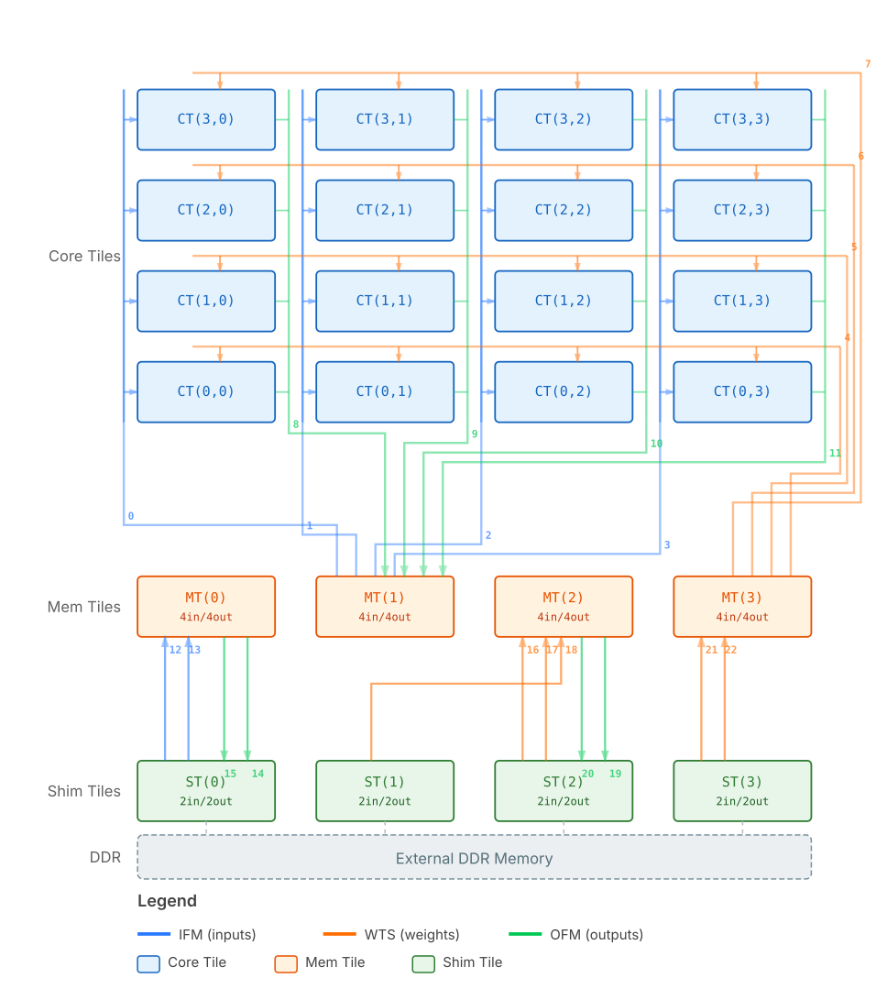
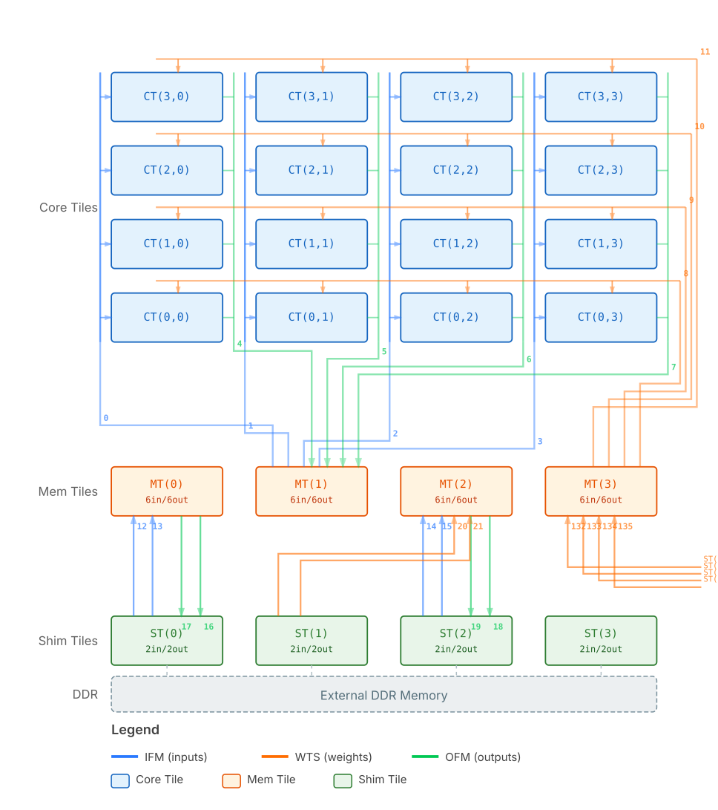
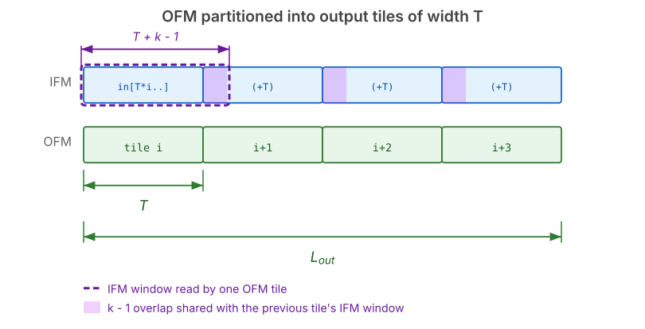
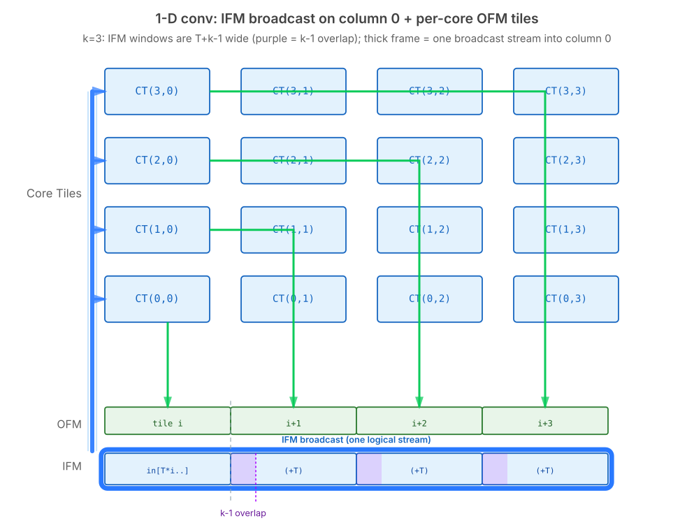
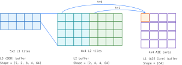
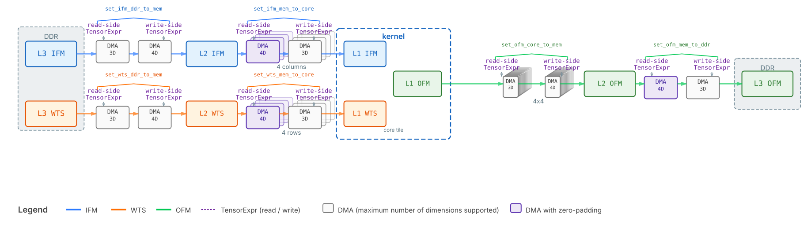
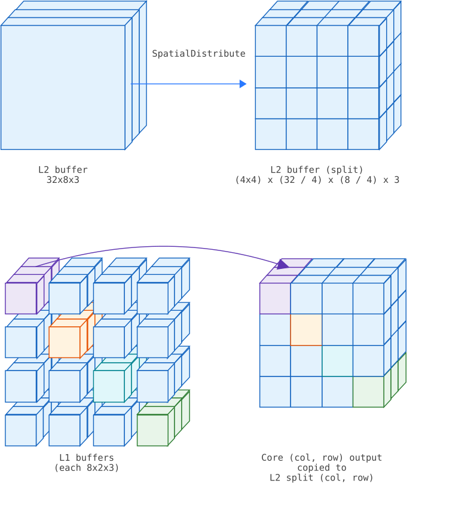

<!--- Copyright (C) 2026 Advanced Micro Devices, Inc. All rights reserved.--->
# Tiling and DMA configuration

AI Engines have the capability to process very large amounts of data despite a limited memory, thanks to their parallelism. The key to programming the AIEs to obtain performance is to make sure each AIE core is efficiently used. A single operator is able to be distributed over several AIE cores at once; one then needs to partition the operator's work so that each core can work in parallel, under the constraints posed by the limited memory capacity of the AIE cores and the architecture's data movement abilities.

The process of adapting a custom op to partition its work is called tiling. There are two tasks to be performed:
* first, decompose the original problem and make the kernel work on a sub-problem;
* second, allocate memory buffers and program data movements and kernel calls across the AIE grid, to process the entire problem.

This documentation will walk you through both of the above steps.

**Related material**

- End-to-end custom op flow (config, tiling script API, overlays): [Custom Ops Flow](README.md).
- Kernel-side coding (what runs on each core, `lp_params`, memory): [AIE Kernel Programming Guide for Custom Ops](kernel_development.md).
- Small examples that grow from untiled → tiled → distributed: [Custom op tutorial index](tutorial/README.md).

## Table of contents

- [AIE Architecture in VAIML](#aie-architecture-in-vaiml)
  - [AIE Components](#aie-components)
  - [AIE topology and VAIML overlay](#aie-topology-and-vaiml-overlay)
- [Tiling process example](#tiling-process-example)
  - [Step 1: decompose the problem; implement each tile in C++](#step-1-decompose-the-problem-implement-each-tile-in-c)
    - [Purpose](#purpose)
    - [Apply loop tiling to the kernel](#apply-loop-tiling-to-the-kernel)
    - [Extract key information about the tile's inputs and outputs](#extract-key-information-about-the-tiles-inputs-and-outputs)
    - [Create an AIE kernel with the right prototype](#create-an-aie-kernel-with-the-right-prototype)
    - [Optimization: re-use weights across calls](#optimization-re-use-weights-across-calls)
  - [Step 2: Allocate memory on the AIE grid and program data movement](#step-2-allocate-memory-on-the-aie-grid-and-program-data-movement)
    - [Abstract calculation of data movement](#abstract-calculation-of-data-movement)
    - [Writing the tiling script](#writing-the-tiling-script)
- [Guidance for kernel tiling](#guidance-for-kernel-tiling)
  - [Tiling and data flow analysis](#tiling-and-data-flow-analysis)
    - [Loop tiling](#loop-tiling)
    - [Tiling of inputs and outputs, data flow analysis](#tiling-of-inputs-and-outputs-data-flow-analysis)
    - [Cost floors and the DDR re-read factor](#cost-floors-and-the-ddr-re-read-factor)
  - [Kernel interface](#kernel-interface)
  - [Buffer usage](#buffer-usage)
  - [Keeping buffers across kernel calls (asynchronous buffers)](#keeping-buffers-across-kernel-calls-asynchronous-buffers)
  - [Random accesses and absolute positioning within tensors](#random-accesses-and-absolute-positioning-within-tensors)
- [Guidance for AIE data movement](#guidance-for-aie-data-movement)
  - [Assignment of AIE cores to tiles](#assignment-of-aie-cores-to-tiles)
- [Python tiling script reference](#python-tiling-script-reference)
  - [Interface and provided information](#interface-and-provided-information)
    - [The `getTiling()` function](#the-gettiling-function)
    - [Obtaining ONNX tensor shapes in the tiling script](#obtaining-onnx-tensor-shapes-in-the-tiling-script)
    - [Using ONNX attributes in the tiling script](#using-onnx-attributes-in-the-tiling-script)
  - [Buffer definition](#buffer-definition)
    - [External buffers](#external-buffers)
    - [AIE buffers](#aie-buffers)
  - [Buffer tiling and traversal order transformation](#buffer-tiling-and-traversal-order-transformation)
  - [Kernel, number of calls and parameters](#kernel-number-of-calls-and-parameters)
  - [Data Movement Setters](#data-movement-setters)
    - [L3 <-> L2 transfers: `set_l3_to_l2_transfer`, `set_l2_to_l3_transfer`](#l3---l2-transfers-set_l3_to_l2_transfer-set_l2_to_l3_transfer)
    - [L2 -> L1 transfers: `set_l2_to_l1_transfer`](#l2---l1-transfers-set_l2_to_l1_transfer)
    - [L1 -> L2 transfers: `set_l1_to_l2_transfer`](#l1---l2-transfers-set_l1_to_l2_transfer)
  - [Kernel Ratios](#kernel-ratios)
  - [Tiling Script Design Tips](#tiling-script-design-tips)
    - [Validation and common pitfalls](#validation-and-common-pitfalls)
- [Troubleshooting tiling](#troubleshooting-tiling)
  - [Frequently encountered errors](#frequently-encountered-errors)
    - [`IO Buffer 'mk[i][j].in[N]' is required to have a total size which is multiple of 4 bytes` (aiecompiler 77-23295)](#io-buffer-mkijinn-is-required-to-have-a-total-size-which-is-multiple-of-4-bytes-aiecompiler-77-23295)
  - [Compiler flags and environment variables](#compiler-flags-and-environment-variables)
  - [Using Python printout](#using-python-printout)
  - [Checking the produced data movement header](#checking-the-produced-data-movement-header)

## AIE Architecture in VAIML

### AIE Components

The AIE is organized as a grid composed of three components:
* AIE Cores, that perform actual arithmetic operations,
* Memory tiles, with a larger capacity then individual AIE cores,
* Data movement engines (also called DMA engines), that transfer data between cores, memory and the external memory.

Programming the AIE requires a kernel, which each AIE core executes, as well as configurations for each of the DMA engines. This guide will explain how to obtain both from an original kernel implementation.

### AIE topology and VAIML overlay

The AIE architecture is seen as a distributed memory hierarchy: AIE cores as the innermost level of memory (L1); memory tiles as the second level (L2); DDR (external memory) as the third and outermost level (L3).

**Programming model:** The C++ code that is written for the kernel gets executed on AIE cores themselves. In VAIML, the same kernel code gets replicated on all the AIE cores of a grid. The kernel only has access to the L1 memory it is provided with when it is called. There is no communication channel with the rest of the AIE grid available to the AIE cores during kernel execution.

**Data movement:** DMA engines perform the memory transfers between the three levels of the memory hierarchy. **The DMAs are not configurable at runtime; the compiler must determine all data movement statically.** In particular, the data transfers performed by the DMAs cannot depend on the data itself. Random access by the kernel is only possible within the L1 buffers.

**DMA source and destination points:** DMAs support reading from / writing to various points in the AIE grid. In VAIML, the access patterns are configurable, but **the source/destination points of each DMA are fixed** and consistent across the entire model. The configuration of source/destination is fixed by an *overlay*.

**List of supported overlays:** The AIE architecture consist in one or more grids of processors, each of which has a 4x4 layout. Depending on the target hardware platform, three overlay variants are available:

- **`rai_1x4x4`** -- used on **AIE2 (STX)** platforms. This lets the operator use one 4x4 grid, i.e. 16 processors, simultaneously.
- **`rai_2x4x4`** -- same as `rai_1x4x4` but with 2 stamps. Used on **AIE2 (STX)** platforms. This lets the operator use two 4x4 grids, i.e. 32 processors, simultaneously.
- **`aie2p_6x4x4`** -- used on **AIE2PS** platforms. This lets the operator use six 4x4 grids, i.e. 96 processors, simultaneously.

All overlays share the same 4x4 core-tile grid and the same connection topology between memtiles and core tiles. The diagrams below show the connections for each overlay (one stamp):

| AIE2 (STX) overlay (`rai_1x4x4`) | AIE2PS overlay (`aie2p_6x4x4`, stamp 0) |
|---|---|
|  |  |

**L3 to L2 channels:** On the `rai_1x4x4` and `aie2p_6x4x4` overlays, there are six L3 to L2 channels that can be used for inputs; each pair of channels targets a different memory tile. That tile and its neighbor may be used as write addresses for L3 to L2 transfers; this means:

| Channel (on above schematic) | Allowed memtiles (`rai_1x4x4`) | Allowed memtiles (`aie2p_6x4x4`)
|------|-----------------------|-----------------------|
| 0, 1 | MT(0) or MT(1)        | MT(0) or MT(1)        |
| 2, 3 | MT(1), MT(2) or MT(3) | MT(1), MT(2) or MT(3) |
| 4, 5 | MT(2) or MT(3)        | MT(1), MT(2) or MT(3) |

**L3 to L2 channels:** Two L2 to L3 channels are at your disposal for L2 to L3 transfers (from the AIE memory tiles back to DDR). On `rai_1x4x4`, `rai_2x4x4` and `aie2p_6x4x4`, these go from memory tile MT(2), and can read back from MT(1), MT(2) or MT(3).

**L2 to L1 channels:** Eight channels are provided for L2 to L1 transfers, i.e. from memory tiles to individual AIE cores. Four of them target the four columns of the AIE, four target the four rows of the AIE stamp.

| Channel (on above schematic) | Physically connected tile | Data origin memory tile | Target cores |
|---|-------|-----------------|-----------------------|
| 0 | MT(1) | MT(0),  MT(1) or MT(2) | CT(0,0), CT(1,0), CT(2,0), CT(3,0) |
| 1 | MT(1) | MT(0),  MT(1) or MT(2) | CT(0,1), CT(1,1), CT(2,1), CT(3,1) |
| 2 | MT(1) | MT(0),  MT(1) or MT(2) | CT(0,2), CT(1,2), CT(2,2), CT(3,2) |
| 3 | MT(1) | MT(0),  MT(1) or MT(2) | CT(0,3), CT(1,3), CT(2,3), CT(3,3) |
| 4 | MT(3) | MT(2) or MT(3) | CT(0,0), CT(0,1), CT(0,2), CT(0,3) |
| 5 | MT(3) | MT(2) or MT(3) | CT(1,0), CT(1,1), CT(1,2), CT(1,3) |
| 6 | MT(3) | MT(2) or MT(3) | CT(2,0), CT(2,1), CT(2,2), CT(2,3) |
| 7 | MT(3) | MT(2) or MT(3) | CT(3,0), CT(3,1), CT(3,2), CT(3,3) |

These are broadcast channels: every target core of a channel receives the same data, and it is not possible to filter the data based on the intended destination core, or selectively enable writes.

**L1 to L2 channels:** Four channels are provided, one per column, for the return of data from AIE cores back to the memory tiles. These all physically target memory tile MT(1), and can therefore write into memory tiles MT(0), MT(1) or MT(2).

| Channel (on above schematic) | Origin cores |
|---|-----------------------|
| 0 | CT(0,0), CT(1,0), CT(2,0), CT(3,0) |
| 1 | CT(0,1), CT(1,1), CT(2,1), CT(3,1) |
| 2 | CT(0,2), CT(1,2), CT(2,2), CT(3,2) |
| 3 | CT(0,3), CT(1,3), CT(2,3), CT(3,3) |

These channels benefit from a packet merging system: dispatching and addressing of the data on the L2 side is possible based on the origin core. Therefore, these channels may be used as unicast from L2 to L1.

## Tiling process example

### Step 1: decompose the problem; implement each tile in C++

#### Purpose

This step covers the tiling of the C++ kernel itself. Its goal is to go from a basic version of the kernel to a tiled version, and to obtain the expression of which data one kernel call needs to compute one tile of output. This abstract information is turned into a concrete script in Step 2 (see [Step 2: Allocate memory on the AIE grid and program data movement](#step-2-allocate-memory-on-the-aie-grid-and-program-data-movement)).

This essentially consists in:
* applying loop tiling to the kernel,
* extracting the inner loops to describe one tile, and wrap it into an AIE kernel,
* determining the "tiling pattern", which is a symbolic relation between a tile of output and tiles of input.

From this 1-dimensional, single-channel convolution:
```cpp
static inline void conv1d(
  const float* __restrict in, // Input feature map (IFM)
  const float* __restrict wts, // Kernel (weights)
  float* __restrict out, // Output feature map (OFM)
  std::size_t L_in, // Length of the IFM (elements)
  std::size_t K // Kernel size
) {
  const std::size_t L_out = L_in - K + 1;
  for (std::size_t o = 0; o < L_out; ++o) {
    float acc = 0.f;
    for (std::size_t k = 0; k < K; ++k)
      acc += in[o + k] * kernel[k];
    out[o] = acc;
  }
}
```

one wants to get the following:
```cpp
// Size of the lp_params that the tiling defines:
//   [0] = T  -- tile size (number of output elements per kernel call)
//   [1] = K  -- kernel (filter) size
//   [2] = calls_per_wts -- number of kernel calls during which the
//                          asynchronous WTS buffer must stay live
static constexpr int conv1d_kernel_lp_size = 3;

template <typename dtype_ifm, typename dtype_wts, typename dtype_ofm>
__attribute__((noinline)) void conv1d_kernel(
    adf::input_buffer_conf<dtype_ifm, adf::bpc_sync_0d> &__restrict ifm,
    adf::input_buffer_conf<dtype_wts, adf::bpc_async_0d> &__restrict wts,
    adf::output_buffer_conf<dtype_ofm, adf::bpc_sync_0d> &__restrict ofm,
    const uint32_t (&lp_params)[conv1d_kernel_lp_size]) {

  const uint32_t T = lp_params[0];
  const uint32_t K = lp_params[1];
  const uint32_t calls_per_wts = lp_params[2];

  static uint16_t core_row = aie::tile::current().id().row % 4;
  const uint32_t ifm_offset = T * core_row;

  // Buffer acquisition: the WTS buffer is acquired on the first call after a rotation.
  static uint32_t wts_call_count = 0;
  if (wts_call_count == 0) {
    wts.acquire();
  }

  auto *ifm_data = (dtype_ifm *__restrict)(ifm.data());
  auto *wts_data = (dtype_wts *__restrict)(wts.data());
  auto *ofm_data = (dtype_ofm *__restrict)(ofm.data());

  // Actual computation: one tile of output is computed for each core.
  for (uint32_t j = 0; j < T; ++j) {
    float acc = 0.f;
    for (uint32_t k = 0; k < K; ++k) {
      acc += float(ifm_data[ifm_offset + j + k]) * float(wts_data[k]);
    }
    ofm_data[j] = dtype_ofm(acc);
  }

  // Buffer release: the WTS buffer is released after the last call.
  wts_call_count += 1;
  if (wts_call_count == calls_per_wts) {
    wts.release();
    wts_call_count = 0;
  }
}
```
as well as the following data flow information:

```
 * Output tiles (buffer `ofm`) of size T
 * Tiles are indexed from i = 0 to i = L_out / T - 1
 * Input tiles (buffer `ifm`) of size T + K
 * For the tile indexed by i:
   * The tile of output produced is out[T * i] to out[T * (i+1) - 1],
   * One tile of input is needed, from in[T * i] to in[T * (i+1) + K - 1].
 * Kernel weights (buffer `wts`) of size K, need to stay unchanged across all kernel calls.
```

#### Apply loop tiling to the kernel

Most kernels that we seek to map to the AI Engine consist of loop nests iterating over certain arrays, applying a mathematical function at each iteration. In most cases, these loops can be broken down piece-wise into an inner loop that describes a piece, and an outer loop that goes across pieces. Such pieces are called tiles, and the process is called loop tiling.

A simple C++ implementation of the kernel that runs on the CPU is an easy starting point.
For example: one can tile the following 1-dimensional convolution:
```cpp
static inline void conv1d_kernel(
  const float* __restrict in, // Input feature map (IFM)
  const float* __restrict kernel, // Kernel (weights)
  float* __restrict out, // Output feature map (OFM)
  std::size_t L_in, // Length of the IFM (elements)
  std::size_t K // Kernel size
) {
  const std::size_t L_out = L_in - K + 1;
  for (std::size_t o = 0; o < L_out; ++o) {
    float acc = 0.f;
    for (std::size_t k = 0; k < K; ++k)
      acc += in[o + k] * kernel[k];
    out[o] = acc;
  }
}
```
by splitting the `L_out` dimension into chunks of size `T`:
```cpp
static inline void conv1d_kernel(
  const float* __restrict in, // Input feature map (IFM)
  const float* __restrict kernel, // Kernel (weights)
  float* __restrict out, // Output feature map (OFM)
  std::size_t L_in, // Length of the IFM (elements)
  std::size_t K, // Kernel size
  std::size_t T // OFM tile size
) {
  // K is the kernel size
  // L_in is the input length
  const std::size_t L_out = L_in - K + 1;
  for (std::size_t i = 0; i < L_out / T; ++i) {
    for (std::size_t j = 0; j < T; ++j) {
      std::size_t o = T * i + j;
      float acc = 0.f;
      for (std::size_t k = 0; k < K; ++k)
        acc += in[o + k] * kernel[k];
      out[o] = acc;
    }
  }
}
```

This breakdown can be visualized as the breakdown of the output feature map into chunks of size T each. Notably, it can be seen that each OFM tile of size `T` needs an IFM window of width `T + K - 1`; this relation determine how much data needs to live in each AIE core for computations to happen.



#### Extract key information about the tile's inputs and outputs

Each AI Engine core will compute one output tile from the above obtained set of tiles.
The outer loop is therefore going to be parallel: multiple tiles will be computed at once.
```cpp
static inline void conv1d_outer_loops(
  const float* __restrict in, // Input feature map (IFM)
  const float* __restrict kernel, // Kernel (weights)
  float* __restrict out, // Output feature map (OFM)
  std::size_t L_in, // Length of the IFM (elements)
  std::size_t K, // Kernel size
  std::size_t T // OFM tile size
) {
  const std::size_t L_out = L_in - K + 1;
  for (std::size_t i = 0; i < L_out / T; ++i) {
    // Compute tile number i
    conv1d_kernel(in, kernel, out, L_in, K, i);
  }
}
```

The inner loop computes one output tile. It is what each AIE core will execute:
```cpp
static inline void conv1d_kernel(
  const float* __restrict in, // Input feature map (IFM)
  const float* __restrict kernel, // Kernel (weights)
  float* __restrict out, // Output feature map (OFM)
  std::size_t K, // Kernel size
  std::size_t T, // OFM tile size
  std::size_t i // Tile index
) {
  for (std::size_t j = 0; j < T; ++j) {
    std::size_t o = T * i + j;
    float acc = 0.f;
    for (std::size_t k = 0; k < K; ++k)
      acc += in[o + k] * kernel[k];
    out[o] = acc;
  }
}
```

**Bufferization:** In the above code, the `in` and `out` arrays are directly indexed from the AIE core. Per the architecture section (see [AIE Architecture in VAIML](#aie-architecture-in-vaiml)), the AIE cores cannot make direct access to external memories. If `in` and `out` are very large arrays, the above code will not work on the AIE.

The solution is to compute the output tile in a local buffer whose size is small, and likewise retrieve a small window of the input, that is only as large as required to compute the output tile.

From the example above, one can determine that the input required to compute one tile is the `K` elements of the kernel, and a window of `T + K` consecutive elements from `in`.

**Relation between output and input tiles:** To compute one tile of the output, the kernel needs a specific tile of the input. This relation is computed by analyzing the tiled loops, and answering the following questions:
* What is the output indexed on?
* When the loop indexing the output traverses one tile, which loops are also iterated on?
* Throughout the loops traversed to compute one output tile, which inputs are accessed?

From the example above, to compute `out[T * i + j]` from `j = 0` to `j = T-1`, the window of elements from `in` that is required is `in[T * i]` to `in[T * (i + 1) + K]`.

With this relation determined, the outer loop can be expressed as memory copies:
```cpp
static inline void conv1d_outer_loops(
  const float* __restrict in, // Input feature map (IFM)
  const float* __restrict kernel, // Kernel (weights)
  float* __restrict out, // Output feature map (OFM)
  std::size_t L_in, // Length of the IFM (elements)
  std::size_t K, // Kernel size
  std::size_t T // OFM tile size
) {
  float *in_buf = (float *)malloc((T + K) * sizeof(float));
  float *out_buf = (float *)malloc(T * sizeof(float));
  for (std::size_t i = 0; i < L_out / T; ++i) {
    // Copy one tile of input (in[T * i] -> in[T * (i+1) + K - 1])
    memcpy(in_buf, in + (T * i), (T + K) * sizeof(float));
    // Perform the computation
    conv1d_kernel(in_buf, kernel, out_buf, L_in, K, T, i);
    // Copy one tile of output (out[T * i] -> out[T * (i+1) - 1])
    memcpy(out + (T * i), T * sizeof(float));
  }
}
```
From this outer loop, we can obtain the following data flow information:
```
 * Input tiles of size T + K
 * Kernel weights of size K.
 * Output tiles of size T
 * Tiles are indexed from i = 0 to i = L_out / T - 1
 * For the tile indexed by i:
   * The tile of output produced is out[T * i] to out[T * (i+1) - 1],
   * One tile of input is needed, from in[T * i] to in[T * (i+1) + K - 1].
```

We have extracted sufficient information from the outer loop to compute the buffer allocation and data movement on the AI Engine. **The outer loop never gets compiled to AIE binary**, and will no longer be used from this point on in the tutorial.

The kernel is adapted to work locally on the buffers to produce its output, removing the need for the `L_in` argument:
```cpp
static inline void conv1d_kernel(
  const float* __restrict in, // Input feature map (IFM)
  const float* __restrict kernel, // Kernel (weights)
  float* __restrict out, // Output feature map (OFM)
  std::size_t K, // Kernel size
  std::size_t T // OFM tile size
) {
  for (std::size_t j = 0; j < T; ++j) {
    float acc = 0.f;
    for (std::size_t k = 0; k < K; ++k)
      acc += in[j + k] * kernel[k];
    out[j] = acc;
  }
}
```

#### Create an AIE kernel with the right prototype

The 1-dimensional convolution takes two input buffers. It therefore needs to have the following prototype (see [Kernel interface](#kernel-interface)):
```cpp
// 2 input parameters: K (Kernel size), T (OFM tile size)
static constexpr int conv1d_kernel_lp_size = 2;

template <typename dtype_ifm, typename dtype_wts, typename dtype_ofm>
__attribute__((noinline)) void conv1d_kernel(
  adf::input_buffer_conf<dtype_ifm, adf::bpc_sync_0d> &__restrict ifm,
  adf::input_buffer_conf<dtype_wts, adf::bpc_sync_0d> &__restrict wts,
  adf::output_buffer_conf<dtype_ofm, adf::bpc_sync_0d> &__restrict ofm,
  const uint32_t (&lp_params)[conv1d_kernel_lp_size]) {
```

which means that this function:
```cpp
static inline void conv1d_kernel(
  const float* __restrict in, // Input feature map (IFM)
  const float* __restrict kernel, // Kernel (weights)
  float* __restrict out, // Output feature map (OFM)
  std::size_t K, // Kernel size
  std::size_t T // OFM tile size
) {
  for (std::size_t j = 0; j < T; ++j) {
    float acc = 0.f;
    for (std::size_t k = 0; k < K; ++k)
      acc += in[j + k] * kernel[k];
    out[j] = acc;
  }
}
```
becomes:
```cpp
// 2 input parameters: K (Kernel size), T (OFM tile size)
static constexpr int conv1d_kernel_lp_size = 2;

template <typename dtype_ifm, typename dtype_wts, typename dtype_ofm>
__attribute__((noinline)) void conv1d_kernel(
  adf::input_buffer_conf<dtype_ifm, adf::bpc_sync_0d> &__restrict ifm,
  adf::input_buffer_conf<dtype_wts, adf::bpc_sync_0d> &__restrict wts,
  adf::output_buffer_conf<dtype_ofm, adf::bpc_sync_0d> &__restrict ofm,
  const uint32_t (&lp_params)[conv1d_kernel_lp_size]) {
{
  // Buffers allocated from the outside
  auto *in = (float *__restrict)(ifm.data());
  auto *kernel = (float *__restrict)(wts.data());
  auto *out = (float *__restrict)(ofm.data());

  // Former numeric arguments to conv1d_kernel
  const uint32_t T = lp_params[0];
  const uint32_t K = lp_params[1];

  // Actual computation: one tile of output is computed for each core.
  for (std::size_t j = 0; j < T; ++j) {
    float acc = 0.f;
    for (std::size_t k = 0; k < K; ++k)
      acc += in[j + k] * kernel[k];
    out[o] = acc;
  }
}
```

The data flow information is augmented with the buffer names:
```
 * Input tiles (buffer `ifm`) of size T + K
 * Kernel weights (buffer `wts`) of size K.
 * Output tiles (buffer `ofm`) of size T
 * Tiles are indexed from i = 0 to i = L_out / T - 1
 * For the tile indexed by i:
   * The tile of output produced is out[T * i] to out[T * (i+1) - 1],
   * One tile of input is needed, from in[T * i] to in[T * (i+1) + K - 1].
```

#### Optimization: re-use weights across calls

In the above kernel, all the buffer arguments are *synchronous*, i.e. their mode of operation is `adf::bpc_sync_0d`:
```cpp
  adf::input_buffer_conf<float, adf::bpc_sync_0d> &__restrict ifm,
  adf::input_buffer_conf<float, adf::bpc_sync_0d> &__restrict wts,
  adf::output_buffer_conf<float, adf::bpc_sync_0d> &__restrict ofm,
```
The buffers `ifm`, `wts` and `ofm` are in principle double-buffers: during a kernel call, the AIE core operates on one half of the buffer, while the other half contains next tile inputs (or previous tile results for `ofm`).

In synchronous mode, the buffers are rotated on every call: one needs to read the weights from DDR on subsequent calls. Since the weights are the same for every tile of OFM, reading them more than once is redundant. To maximize I/O efficiency, the `wts` input buffer should stay unchanged across kernel calls.

To make this happen, we need to:
* change the mode of operation of the `wts` argument to `adf::bpc_async_0d`:
```cpp
  adf::input_buffer_conf<dtype_wts, adf::bpc_async_0d> &__restrict wts,
```
* provide the number of kernel calls (see [Kernel Ratios](#kernel-ratios)) across which buffer rotation does not happen, and after which a rotation will happen; this adds an additional entry into `lp_params`, whose size becomes 3:
```cpp
// 3 input parameters: K (Kernel size), T (OFM tile size), calls_per_wts (number of calls to the kernel)
static constexpr int conv1d_kernel_lp_size = 3;

// template <typename dtype_ifm, typename dtype_wts, typename dtype_ofm>
// __attribute__((noinline)) void conv1d_kernel(...) {
// [...]
  const uint32_t calls_per_wts = lp_params[2];
```
The value of `calls_per_wts` is the total number of calls to the kernel. It is dependent on the size of the input. It will be computed in the tiling script.
* acquire the buffer on the first call, and release it on the last call:
```cpp
// template <typename dtype_ifm, typename dtype_wts, typename dtype_ofm>
// __attribute__((noinline)) void conv1d_kernel(...) {
    // Buffer acquisition: the WTS buffer is acquired on the first call after a rotation.
    static uint32_t wts_call_count = 0;
    if (wts_call_count == 0) {
      wts.acquire();
    }

    // Get the buffer pointers _after_ acquisition
    auto *ifm_data = (dtype_ifm *__restrict)(ifm.data());
    auto *wts_data = (dtype_wts *__restrict)(wts.data());
    auto *ofm_data = (dtype_ofm *__restrict)(ofm.data());

    // Actual computation: one tile of output is computed for each core.
    // [...]

    // Buffer release: the WTS buffer is released after the last call.
    wts_call_count += 1;
    if (wts_call_count == calls_per_wts) {
        wts.release();
        wts_call_count = 0;
    }
}
```

This gives the final kernel:
```cpp
// 3 input parameters: K (Kernel size), T (OFM tile size), calls_per_wts (number of calls to the kernel)
static constexpr int conv1d_kernel_lp_size = 3;

template <typename dtype_ifm, typename dtype_wts, typename dtype_ofm>
__attribute__((noinline)) void conv1d_kernel(
    adf::input_buffer_conf<dtype_ifm, adf::bpc_sync_0d> &__restrict ifm,
    adf::input_buffer_conf<dtype_wts, adf::bpc_async_0d> &__restrict wts,
    adf::output_buffer_conf<dtype_ofm, adf::bpc_sync_0d> &__restrict ofm,
    const uint32_t (&lp_params)[conv1d_kernel_lp_size]) {

    // Former numeric arguments to conv1d_kernel
    const uint32_t T = lp_params[0];
    const uint32_t K = lp_params[1];
    const uint32_t calls_per_wts = lp_params[2];

    // Buffer acquisition: the WTS buffer is acquired on the first call after a rotation.
    static uint32_t wts_call_count = 0;
    if (wts_call_count == 0) {
      wts.acquire();
    }

    // Get the buffer pointers _after_ acquisition
    auto *ifm_data = (dtype_ifm *__restrict)(ifm.data());
    auto *wts_data = (dtype_wts *__restrict)(wts.data());
    auto *ofm_data = (dtype_ofm *__restrict)(ofm.data());

    // Actual computation: one tile of output is computed for each core.
    for (std::size_t j = 0; j < T; ++j) {
        float acc = 0.f;
        for (std::size_t k = 0; k < K; ++k)
            acc += in[j + k] * kernel[k];
        out[o] = acc;
    }

    // Buffer release: the WTS buffer is released after the last call.
    wts_call_count += 1;
    if (wts_call_count == calls_per_wts) {
        wts.release();
        wts_call_count = 0;
    }
}
```

and the asynchronous buffer information is added to the data flow relation:
```
 * Input tiles (buffer `ifm`) of size T + K
 * Kernel weights (buffer `wts`) of size K, need to stay unchanged across all kernel calls.
 * Output tiles (buffer `ofm`) of size T
 * Tiles are indexed from i = 0 to i = L_out / T - 1
 * For the tile indexed by i:
   * The tile of output produced is out[T * i] to out[T * (i+1) - 1],
   * One tile of input is needed, from in[T * i] to in[T * (i+1) + K - 1].
```

### Step 2: Allocate memory on the AIE grid and program data movement

Step 1 has created a kernel and obtained data flow information that apply to each individual tiles. The AIE consists of a grid of processors with determined communication channels (see [AIE Architecture in VAIML](#aie-architecture-in-vaiml)).

The next step is to program the data movement on the AI Engine. To that effect, one needs to write a script called the *tiling script*, taking into account the AIE's topology specifics (see [AIE topology and VAIML overlay](#aie-topology-and-vaiml-overlay)).

To build such a tiling script, we need to:
* select a AIE core for each tile:
* determine which data is needed to feed *all the cores* in the AIE grid,
* configure the DMAs to transfer data in and out of the AIE memory tiles and cores.

#### Abstract calculation of data movement

Before implementing the script, we need to calculate the data movement and memory allocation using the data flow information.

From our kernel and outer loops, we determined the following data flow information:
```
 * Input tiles (buffer `ifm`) of size T + K
 * Kernel weights (buffer `wts`) of size K, need to stay unchanged across all kernel calls.
 * Output tiles (buffer `ofm`) of size T
 * Tiles are indexed from i = 0 to i = L_out / T - 1
 * For the tile indexed by i:
   * The tile of output produced is out[T * i] to out[T * (i+1) - 1],
   * One tile of input is needed, from in[T * i] to in[T * (i+1) + K - 1].
```

Producing `out[T * i]` to `out[T * (i+1) - 1]` requires:
* the entire kernel `kernel[0]` to `kernel[K-1]`, and
* the inputs `in[T * i]` to `in[T * (i+1) + K - 1]`.

We now focus on the `in` input distribution.

The `in` tensor goes through the IFM channel. According to the overlay (see [AIE topology and VAIML overlay](#aie-topology-and-vaiml-overlay)), IFMs are broadcast along columns of 4 AIE cores: this means that along an AIE column, all the AIE cores will receive the same input data, regardless of how much of it they actually use.

The IFM broacasting scheme is shown in blue in the following figure:



Two consecutive tiles `i` and `i+1` require the following input:
* Tile `i`: `in[T * i]` to `in[T * (i+1) + K - 1]`
* Tile `i+1`: `in[T * (i+1)]` to `in[T * (i+2) + K - 1]`

These two inputs overlap on the `k` elements `in[T * (i+1)]` to `in[T * (i+1) + K - 1]`. By broadcasting `in[T * i]` to `in[T * (i+2) + K - 1]` through the IFM channel, we satisfy the input requirements of both tiles.
Since each column has 4 AIE cores, it is sufficient to broadcast `in[T * i]` to `in[T * (i+4) + K - 1]` through so that each core can process its tile, which makes a total volume of `4*T + k` elements.

The cores' respective OFMs are then concatenated to obtain the final output, as is shown in green on the schematic; there is no broadcast of the OFMs.

Let's now generalize this scheme to 4 columns:
| Column | Tiles produced |
| --- | --- |
| 0 | 0, 1, 2, 3 |
| 1 | 4, 5, 6, 7 |
| 2 | 8, 9, 10, 11 |
| 3 | 12, 13, 14, 15 |

Should there be more than 16 tiles, this pattern will be repeated with tile indices modulo 16: the general formula is that cores will be assigned tiles `i % 16`, `(i + 1) % 16`, up to `(i + 15) % 16`.

We now have enough information to determine the **entire data movement on the AIE**:

Each 4x4 grid produces **16 consecutive tiles** of the output:
* Each column (numbered `C`) needs `4*T + k` elements, starting from `in[T * (i + 4*C)]` to `in[T * (i + 4*C + 4) + K - 1]`.
* In total, to process tiles `i` through `i + 15`, we need to transfer elements `in[T * i]` to `in[T * (i + 16) + K - 1]` into the AIE.
* Tiles `i` through `i + 15` produce elements `out[T * i]` to `out[T * (i + 16) - 1]` (a total of `T * 16` elements).

#### Writing the tiling script

Let's write a script that configures the DMA transfers based on the information computed above, using Tensor Expressions. The full script lives in `tutorial/conv1d/0_distributed/custom_op_conv1d/custom_conv1d_tiling.py`.

* Unpack the op interface and name the overlay constants. The tile size `T` is set here.
```py
    ifm, wts, ofm = opInterface

    OVERLAY_COLS = 4
    OVERLAY_ROWS = 4
    N_CORES = OVERLAY_COLS * OVERLAY_ROWS

    # Tile size (one core's OFM contribution).
    T = 64
```

* Get the stamp to be configured:
```py
    nb_stamps = len(tiling)
    # Configure each stamp.
    for stamp in tiling:
        spu = stamp[0]
    # or configure only one stamp:
    spu = tiling[0][0]
```

* Get the `L_in` and `K` parameters, as well as `L_out` (length of the output). We get *padded* tensors (the compiler pads the innermost ONNX dim to a 32-bit boundary), and check the consistency of the input and output lengths:
```py
    (L_in,) = ifm.getPaddedShape()
    (K,) = wts.getPaddedShape()
    (L_out,) = ofm.getPaddedShape()
    # K = K_padded. K_padded is always even (innermost ONNX dim is rounded
    # up to a 32-bit boundary, which for bfloat16 means pairs of elements), so
    # `K` is also even and `4*T + K` is even -> per-core IO buffers
    # satisfy the aiecompiler 4-byte total-size constraint. We need at least
    # K - 1 K elements for the convolution; one extra trailing element is
    # transferred but unused by the kernel.
    K = K
    assert K % 2 == 0, f"K must be even for bf16 4-byte alignment (got {K})"

    # The last DDR window ends at (calls_per_wts - 1) * (N_CORES * T) +
    # (N_CORES * T + K) == L_out + K. Make sure the padded IFM is big
    # enough to back that read; the compiler's auto-padding usually provides
    # the missing bytes (e.g. L_in = 4103 -> padded 4104 covers a K of 8).
    assert L_in >= L_out + K, (
        f"Padded L_in ({L_in}) must be >= L_out + K "
        f"({L_out} + {K} = {L_out + K}) so the last IFM window fits"
    )
```

* Calculate the number of kernel calls, to provide the `calls_per_wts` parameter, necessary for the asynchronous buffer rotation (see [Optimization: re-use weights across calls](#optimization-re-use-weights-across-calls)). `NT` is the total number of `T`-element OFM tiles; one L2 rotation feeds 16 of them (one per core), so we run `wts_call_count` rotations and the WTS buffer stays live for the whole compilation:
```py
    # Total number of OFM tiles. Must be a multiple of the 4x4 grid size so
    # that each L2 rotation covers exactly 16 tiles, one per core.
    NT = L_out // T
    assert NT * T == L_out, f"L_out ({L_out}) must be a multiple of T ({T})"
    assert NT % N_CORES == 0, (
        f"NT ({NT}) must be a multiple of {N_CORES} so the workload distributes"
        " evenly across the 4x4 grid"
    )

    # Number of L3->L2 rotations.
    # This is the number of consecutive kernel calls during which the WTS buffer
    # stays constant. The whole filter is reused for every output tile, so it
    # can remain live for the entire computation.
    calls_per_wts = NT // N_CORES
```

* Create the L2 (memtile) buffers (see [Buffer definition](#buffer-definition)):
  * `ifm` is placed in tile MT(0) for column-wise distribution to L1; it is double-buffered and sized for 16 tiles;
  * `wts` is placed in tile MT(3) for row-wise distribution to L1; it is single-buffered (it stays constant) on memtile column 3;
  * `ofm` is placed in tile MT(2), shaped `[OVERLAY_COLS, OVERLAY_ROWS, T]` so as to fit 16 output tiles:
```py
    ifm_l2 = tensor_expr.TensorVar.make(
        locations=[
            tensor_expr.Location(0, 0, 0x00000),
            tensor_expr.Location(0, 0, 0x10000),
        ],
        shape=[N_CORES * T + K],
        type=ifm.getDType(),
    )
    wts_l2 = tensor_expr.TensorVar.make(
        locations=[tensor_expr.Location(3, 0, 0x00000)],
        shape=[K],
        type=wts.getDType(),
    )
    ofm_l2 = tensor_expr.TensorVar.make(
        locations=[
            tensor_expr.Location(2, 0, 0x00000),
            tensor_expr.Location(2, 0, 0x10000),
        ],
        shape=[OVERLAY_COLS, OVERLAY_ROWS, T],
        type=ofm.getDType(),
    )
```

* Create the per-core L1 buffers (see [Buffer definition](#buffer-definition)):
  * `ifm`: each core in a column receives `4*T + K` IFM elements (broadcast) and uses its row index to pick its own slice.
  * `wts` is the full filter, single-buffered (no rotation is performed across kernel calls).
  * `ofm` is one `T`-element tile per core, double-buffered.
```py
    ifm_l1 = tensor_expr.TensorVar.make(
        [OVERLAY_ROWS * T + K],
        ifm.getDType(),
        tensor_expr.BufferingStrategy.DoubleBuffered,
    )
    wts_l1 = tensor_expr.TensorVar.make(
        [K],
        wts.getDType(),
        tensor_expr.BufferingStrategy.SingleBuffered,
    )
    ofm_l1 = tensor_expr.TensorVar.make(
        [T],
        ofm.getDType(),
        tensor_expr.BufferingStrategy.DoubleBuffered,
    )
```

* Configure the L3<->L2 transfers (see [Data movement setters](#data-movement-setters)):
  * The IFM DDR pointer is tiled into `wts_call_count` overlapping windows of `N_CORES * T + K` elements, and the next window starts `N_CORES * T` later.
  This is done using the `Tile` function (see [Buffer tiling and traversal order transformation](#buffer-tiling-and-traversal-order-transformation)).
  Note that only `T + K - 1` elements are used by the kernel, but the transfer needs to be a multiple of 32 bits; having asserted that `K` is even, we need to transfer one extra element.
  * The WTS is transferred in full once.
  * The OFM L2 is reshaped from `[OVERLAY_COLS, OVERLAY_ROWS, T]` down to a flat `N_CORES * T`-element block before being written back to DDR:
```py
    # Get a DDR channel targeting MT(0)
    ifm_l3_l2 = [ch for ch in spu.get_l3_to_l2_channels() if ch.mem_tile_port.tile_col == 0][0]
    # Transfer a tile of IFM
    spu.set_l3_to_l2_transfer(
        ifm_l3_l2,
        ifm.getTensorVar().Tile(
            index=0,
            stride=N_CORES * T,
            tileLen=N_CORES * T + K,
            numTiles=wts_call_count,
        ),
        ifm_l2,
    )

    # Get a DDR channel targeting MT(3)
    wts_l3_l2 = [ch for ch in spu.get_l3_to_l2_channels() if ch.mem_tile_port.tile_col == 3][0]

    # The whole (padded) WTS is transferred once and reused.
    spu.set_l3_to_l2_transfer(wts_l3_l2, wts.getTensorVar(), wts_l2)

    # Get a L2 to L3 channel
    ofm_l2_l3 = spu.get_l2_to_l3_channels()[0]
    # OFM DDR is written back in 16*T-element blocks.
    spu.set_l2_to_l3_transfer(
        ofm_l2_l3,
        ofm_l2.Reshape([N_CORES * T]),
        ofm.getTensorVar().TileBy(index=0, tileLen=N_CORES * T),
    )
```

* Configure the L2 -> L1 IFM transfer. The L2 IFM is split into `OVERLAY_COLS` overlapping column tiles of `4*T + K` elements (see [Buffer tiling and traversal order transformation](#buffer-tiling-and-traversal-order-transformation)); each column tile is broadcast to its column's 4 cores:
```py
    ifm_per_column = ifm_l2.Tile(
        index=0,
        stride=OVERLAY_ROWS * T,
        tileLen=OVERLAY_ROWS * T + K,
        numTiles=OVERLAY_COLS,
    )
    for col, ch in enumerate(spu.get_l2_to_l1_channels(broadcast=tensor_expr.broadcast_on.COLUMNS)):
        spu.set_l2_to_l1_transfer(ch, ifm_per_column[col], ifm_l1)
```

* Configure the L2 -> L1 WTS transfer. The full WTS buffer is broadcast once to every row, so both sides of `set_l2_to_l1_transfer` are lists of `OVERLAY_ROWS` entries:
```py
    for ch in spu.get_l2_to_l1_channels(broadcast=tensor_expr.broadcast_on.ROWS):
        spu.set_l2_to_l1_transfer(
            ch,
            wts_l2,
            wts_l1,
            ratio=math.ceil(NT / N_CORES)
        )
```
Note the `ratio` argument we used: `NT / N_CORES` is the number of kernel calls, therefore the kernel can hold the same weights for the entire duration of the op, without needing to transfer them again (see [Kernel ratios](#kernel-ratios)).

* Configure the L1 -> L2 OFM collection. `ofm_l2` is already shaped `[OVERLAY_COLS, OVERLAY_ROWS, T]`, so `SpatialDistribute2D` cuts those two outermost dimensions and each core writes its `[T]` slice into one `(col, row)` location:
```py
    ofm_spatial_dist = ofm_l2.SpatialDistribute2D(
        dimA=0, dimB=1, tileACount=OVERLAY_COLS, tileBCount=OVERLAY_ROWS
    )
    for col, ch in enumerate(spu.get_l2_to_l1_channels(broadcast=tensor_expr.broadcast_on.ROWS)):
      spu.set_l1_to_l2_transfer(
          ch,
          ofm_l1,
          ofm_spatial_dist[col],
      )
```

Finally, we configure how the kernel is called. The `lp_params` (`T`, `K`, and `calls_per_wts`) are passed in the same `set_kernel` call:
```py
    # Set the kernel's arguments to be the L1 buffers we wrote into
    ph.set_kernel_arguments([ifm_l1, wts_l1, ofm_l1])
    # Set the kernel parameters (`lp_params`)
    ph.set_kernel_params([T, K, calls_per_wts])
    # Give the number of kernel calls
    ph.set_kernel_nb_calls(NT / N_CORES)
    # Give the compiler the name of the kernel to call and the file that implements it
    ph.set_kernel_function_name("conv1d_kernel")
    ph.set_kernel_impl(Path("conv1d.cpp"))
```

## Guidance for kernel tiling

This section provides general advice with respect to creating the tiled kernel and extracting the relevant data flow information.

### Tiling and data flow analysis

Tiling consists in the subdivision of an iteration domain into smaller pieces, in such a way that each piece can be executed on a processor and its (usually small) local memory. It also enables parallelism, in that multiple smaller pieces are executed in parallel.

#### Loop tiling

Starting from an existing code, one can mechanically apply loop tiling. A technique that is commonly applicable to obtain tiling from an existing loop nest is to:

1. apply *strip-mining*: split a dimension into blocks of a certain size; then
```cpp
for (std::size_t i = 0; i < N; ++i)
  for (std::size_t j = 0; j < K; ++j)
    // Iteration (i, j)
```
becomes
```cpp
for (std::size_t i = 0; i < N; ++i)
  for (std::size_t j0 = 0; j0 < K / T; ++j0) // K % T == 0
    for (std::size_t j1 = 0; j1 < T; ++j1)
      // Iteration (i, T * j0 + j1)
```
2. apply *loop inversion*: move the outer loop `j0` to outside the loop nest; then
```cpp
for (std::size_t i = 0; i < N; ++i)
  for (std::size_t j0 = 0; j0 < K / T; ++j0) // K % T == 0
    for (std::size_t j1 = 0; j1 < T; ++j1)
      // Iteration (i, T * j0 + j1)
```
becomes
```cpp
for (std::size_t j0 = 0; j0 < K / T; ++j0) // K % T == 0
  // One tile
  for (std::size_t i = 0; i < N; ++i)
    for (std::size_t j1 = 0; j1 < T; ++j1)
      // Iteration (i, T * j0 + j1)
```

**These operations are not always legal.** The legality of these operations depends on the loop bounds, and what the loop is executing. For conceptual information about tiling and its legality, refer to online resources such as the [Wikipedia sheet on loop tiling](https://en.wikipedia.org/wiki/Loop_tiling).

#### Tiling of inputs and outputs, data flow analysis

Although tiling is an operation on the kernel's *iteration domain*, i.e. its loop nest, tiling can be computed starting from the outputs (resp. inputs). Instead of tiling with an arbitrary size `T` like in the above Loop tiling section (see [Loop tiling](#loop-tiling)), one needs to break down an output (resp. input) array, and determine how big the iteration tiles that produce each piece of the output (resp. consume each piece of the input) are. Then, one can determine the size of the associated inputs (resp. outputs).

The *data flow analysis* consists in building a formal relation between the inputs and the outputs of the kernel, that encodes, for each output element that gets computed, which input elements are needed to compute it.

**Example:** tiling the following loop from the outputs.
```cpp
for (std::size_t i = 0; i < 128; ++i)
  for (std::size_t j = 0; j < 1024; ++j) {
    out[i][j] = in[j + 2] * j;
  }
```
We want to make blocks of `out` of size 4*8: `out[0][0]` to `out[0][7]`, `out[1][0]` to `out[1][7]`, `out[0][8]` to `out[0][15]`, etc.; all the way to `out[127][1023]`.

Symbolically expressed, these blocks are the rectangles from `out[4*i0][8*j0]` to `out[4*i0+3][8*j0+7]`, where `i0` and `j0` are between 0 and respectively 128 / 4 = 32 and 1024 / 8 = 128.

There is only one iteration that contributes to `out[i][j]`, which is the `(i, j)`-th. Therefore, we tile the `i` loop with size 4 and the `j` loop with size 8: the loop `i` is broken into two loops `i0` and `i1` where `i = 4*i0 + i1`, and `j = 8*j0 + j1` likewise.

```cpp
for (std::size_t i0 = 0; i0 < 32; ++i0)
  for (std::size_t j0 = 0; j0 < 128; ++j0)
    // One tile
    for (std::size_t i1 = 0; i1 < 4; ++i1)
      for (std::size_t j1 = 0; j1 < 8; ++j1) {
        // Iteration (4*i0 + i1, 8*j0 + j1)
        out[4*i0 + i1][8*j0 + j1] += in[4*i0 + i1 + 2] * (8*j0 + j1);
      }
```
To compute `out[4*i0][8*j0]` to `out[4*i0+3][8*j0+7]`, one needs a full iteration of the `i1` and `j1` loop. Throughout this iteration, `in[4*i0 + 2]` to `in[4*i0 + 3 + 2]` are needed. We then need to tile `in` with tile size 4, starting at offset 2.

The above analysis can be written as the following data flow relation:
```
 * Input tiles of size 4, starting at offset 2
 * Output tiles of size 4*8
 * Tiles are indexed from i0 = 0 to i0 = 32, j0 = 0 to j0 = 128
 * For the tile indexed by (i0, j0):
   * The tile of output produced is out[4*i0][8*j0] to out[4*i0+3][8*j0+7],
   * One tile of input is needed, from in[4*i0 + 2] to in[4*i0 + 3 + 2].
```

Take note of this relation that is needed to build the tiling script: see Step 2: Allocate memory on the AIE grid and program data movement (see [Step 2: Allocate memory on the AIE grid and program data movement](#step-2-allocate-memory-on-the-aie-grid-and-program-data-movement)) for an example, and Python tiling script reference (see [Python tiling script reference](#python-tiling-script-reference)) for the reference.

#### Cost floors and the DDR re-read factor

The data-flow relation above tells you *which* input tiles each output tile
needs. At this point, you can compute whether your kernel is intrinsically memory or compute-bound. This will help you determine whether to optimize the kernel or tiling.

**1.Compute the memory transfer and compute time floor.**
```
DMA floor      = sum(tensor volumes, each counted ONCE) / effective DDR BW
compute floor  = total MACs / (peak MACs per cycle per core * cores) / clock
achievable    ~= max(DMA floor, compute floor)
```

The larger floor names the regime (DMA-bound vs compute-bound), i.e. what is
worth optimizing.

For instance, taking a Conv 1x1 + Add + ReLU with a 1x384x32x32 shape and bf16 type:
IFM + WTS + OFM = 768 KB + 294 KB + 768 KB ~= **1.83 MB**; at ~12 GB/s, the DMA
floor is ~156 us.

The compute floor for the same op: a 1x1 conv is `Cout * Cin` MACs per pixel, so
`384 * 384 * 32 * 32` ~= **151 M MACs** (the Add and ReLU add one elementwise pass
each over 393 K elements -- negligible). On one 4x4 stamp at 512 bf16 MACs per
cycle per core (one `aie::mmul<8,8,8>` issue; see
[the conv2d tutorial](/docs/30_custom_ops/tutorial/conv2d/conv3x3_int8_2stamp)), that is
`151e6 / (512 * 16)` ~= 18.4 K cycles, i.e. **~15 us** at a 1.25 GHz core clock.

Compute is therefore ~10x cheaper than the transfers, so the op is DMA-bound: in
this case, tiling is to be optimized rather than the kernel. (Both the ~12 GB/s
and the clock are platform figures -- substitute your target's.)

**2. Compute each tensor's DDR re-read factor.**

A tensor that is reused across an outer loop, but is not kept on-chip across that
loop, re-crosses DDR once per pass. Its DDR traffic is:

```
tensor DDR traffic = volume * reread
    reread = product of the .Repeat(...) factors applied at the L3<->L2 transfer
             (repeats at L2->L1 do not touch DDR and do not count)
```

A `reread` above 1 on a sizeable tensor means the design pays a multiple of the
floor. This is a structural property of the dataflow -- the wrong operand is
being re-streamed -- rather than a tile-size knob to tune later. The fix is the
classic stationarity choice: keep the smaller reused operand resident in L2, and
hold the other in L1 across the inner loop, so that neither re-crosses DDR and
the total traffic falls back to the floor. Operands are held across calls using
asynchronous buffers, described in [Keeping buffers across kernel calls (asynchronous buffers)](#keeping-buffers-across-kernel-calls-asynchronous-buffers).

For instance, on the same conv: a tiling that streams the IFM once per
output-channel block re-reads it `n_blocks = 6` times, so IFM traffic is
768 KB x 6 = 4.5 MB and the total is 5.6 MB, or 3.1x the floor (measured
~484 us). Making the weights resident in L2 and holding the IFM in L1 brings
every `reread` back to 1, for a total of 1.83 MB, at the floor (measured
~152 us). Same operator, same kernel: a purely structural change worth 4.3x.

A tiling whose re-read factor exceeds 1 on a sizeable tensor is therefore best
corrected before compiling, since no amount of later parameter tuning recovers
the traffic it costs.

### Kernel interface

There are two function prototypes accepted for custom ops.
* For functions that require one input buffer:
```cpp
template <typename dtype_ifm, typename dtype_ofm>
__attribute__((noinline)) void kernel_name(
  adf::input_buffer_conf<dtype_ifm, /*adf::bpc_sync_0d or bpc_async_0d*/> &__restrict input_a,
  adf::output_buffer_conf<dtype_ofm, /*adf::bpc_sync_0d or bpc_async_0d*/> &__restrict output,
  const uint32_t (&lp_params)[NB_PARAMS]);
```
* For functions that require two input buffers:
```cpp
template <typename dtype_ifm, typename dtype_wts, typename dtype_ofm>
__attribute__((noinline)) void kernel_name(
  adf::input_buffer_conf<dtype_ifm, /*adf::bpc_sync_0d or bpc_async_0d*/> &__restrict input_a,
  adf::input_buffer_conf<dtype_wts, /*adf::bpc_sync_0d or bpc_async_0d*/> &__restrict input_b,
  adf::output_buffer_conf<dtype_ofm, /*adf::bpc_sync_0d or bpc_async_0d*/> &__restrict output,
  const uint32_t (&lp_params)[NB_PARAMS]);
```

The `input_a` and `input_b` arguments are the L1 buffers that are passed to the AIE core. Per the overlay, there are at most two of them.

**Remarks:**
* The kernel function name is free to choose, and must be set in the tiling script using `set_kernel_function_name`; likewise, the kernel's implementation file must be set using `set_kernel_impl` (see [Writing the tiling script](#writing-the-tiling-script)). Each stamp can use a different kernel file and call a different function.
* The templating is mandatory, even if the types are fixed by the kernel.
* `lp_params` can contain an arbitrary number of parameters. Their type is necessarily `uint32_t`, but you may cast and reinterpret these as necessary within the kernel.
* Choosing `adf::bpc_sync_0d` or `adf::bpc_async_0d` depends on whether double-buffering rotation should happen every call. For those L1 buffers given to the kernel (using `set_kernel_arguments`) whose type is `adf::bpc_async_0d`, the L2 to L1 or L1 to L2 transfers (`set_l2_to_l1_transfer`, `set_l1_to_l2_transfer`) must bear a `ratio` argument with the ratios. See [Keeping buffers across kernel calls (asynchronous buffers)](#keeping-buffers-across-kernel-calls-asynchronous-buffers).
* Per the overlay (see [AIE Topology and VAIML overlay](#aie-topology-and-vaiml-overlay)), both the `input_a` and `input_b` buffers are populated using broadcast channels, either column-wise or row-wise, from L2 memories. Every core on either a row or a column will therefore have the same contents. The buffers across a row or column are nevertheless physically independent, and changes in one core will not be reflected in other cores. See the [Writing the tiling script](#writing-the-tiling-script) section.


### Buffer usage

One cannot directly access the `input_a`, `input_b` and `output` buffer objects. Pointers are obtained using the `data()` method:

```cpp
template <typename dtype_ifm, typename dtype_wts, typename dtype_ofm>
__attribute__((noinline)) void kernel_name(
  adf::input_buffer_conf<dtype_ifm, /*adf::bpc_sync_0d or bpc_async_0d*/> &__restrict input_a,
  adf::input_buffer_conf<dtype_wts, /*adf::bpc_sync_0d or bpc_async_0d*/> &__restrict input_b,
  adf::output_buffer_conf<dtype_ofm, /*adf::bpc_sync_0d or bpc_async_0d*/> &__restrict output,
  const uint32_t (&lp_params)[NB_PARAMS]) {

  auto *input_a_data = (dtype_ifm *__restrict)(input_a.data());
  auto *input_b_data = (dtype_wts *__restrict)(input_b.data());
  auto *output_data = (dtype_ofm *__restrict)(output.data());
}
```

### Keeping buffers across kernel calls (asynchronous buffers)

The asynchronous buffer feature allows a buffer to be reused across several kernel calls, instead of being reloaded or re-emitted every single call. This is useful for advanced tiling and scheduling scenarios, such as overlapping data for multi-tile reductions or broadcasts.

To use asynchronous buffers, you must explicitly declare, for each buffer port, how many kernel calls the buffer should remain unchanged. This is done by specifying the number of kernel calls per buffer in the `ratio` argument on the L2 to L1 (or L1 to L2) transfer in your tiling script. For example, if a buffer will be used for 4 kernel calls before being updated, you would set its kernel ratio to 4.

On the C++ kernel side, the kernel is responsible for acquiring and releasing asynchronous buffers for the required duration.

The kernel must:
* explicitly *acquire* the buffer before calling `.data()`,
* process the correct number of calls (kernel ratio) before releasing the buffer is considered released,
* *release* the buffer after the right number of kernel calls are elapsed.

The VAIML runtime guarantees that the buffer will stay unchanged for the promised number of calls (as set in the `ratio` parameter of `set_l2_to_l1_transfer`), and it is critical that your kernel code honors this contract for correctness.

**Example:** to declare the second input of a kernel to be kept for 4 calls, one needs to:

- In the tiling script (Python), kernel ratios are passed through `set_l2_to_l1_transfer`:
  ```python
  spu.set_l2_to_l1_transfer(
    l2_to_l1_channel, l2_buf, l1_buf, ratio=4 # buffer stays constant for 4 kernel invocations
  )
  ```
- The kernel's prototype on the second input needs to use `adf::bpc_async_0d` as a mode.
- In the kernel (C++), use the buffer’s acquire/release API, and ensure you process exactly the number of calls promised by `kernel_ratios` before changing the asynchronous buffer.
```cpp
template <typename dtype_a, typename dtype_b, typename dtype_c>
void my_kernel(
  adf::input_buffer_conf<dtype_a, adf::bpc_sync_0d> &__restrict input_a,
  adf::input_buffer_conf<dtype_b, adf::bpc_async_0d> &__restrict input_b,
  adf::output_buffer_conf<dtype_c, bpc_sync_0d> &__restrict output,
  const uint32_t (&lp_params)[lp_size]
);
```

Buffer acquisition is done as follows:

```cpp
template <typename dtype_a, typename dtype_b, typename dtype_c>
void my_kernel(
  adf::input_buffer_conf<dtype_a, adf::bpc_sync_0d> &__restrict input_a,
  adf::input_buffer_conf<dtype_b, adf::bpc_async_0d> &__restrict input_b,
  adf::output_buffer_conf<dtype_c, bpc_sync_0d> &__restrict output,
  const uint32_t (&lp_params)[lp_size]
) {
  static uint32_t tile_count = 0;
  if(tile_count == 0) {
    input_b.acquire();
  }
  // Only use input_b after acquisition.
  auto *input_b_data = input_b.data();

  // ... processing code ...

  // Update tile count and release the buffer if we've reached 4 uses of it
  tile_count += 1;
  if(tile_count == 4) {
    input_b.release();
    tile_count = 0;
  }

}
```

**Remark**: It is possible to use a run-time parameter (using `lp_params`) to give the kernel ratios from the tiling script to the kernel. These can then be dependent on the op instance rather than statically encoded.
```cpp
template <typename dtype_a, typename dtype_b, typename dtype_c>
void my_kernel(
  adf::input_buffer_conf<dtype_a, adf::bpc_sync_0d> &__restrict input_a,
  adf::input_buffer_conf<dtype_b, adf::bpc_async_0d> &__restrict input_b,
  adf::output_buffer_conf<dtype_c, bpc_sync_0d> &__restrict output,
  const uint32_t (&lp_params)[lp_size]
) {
  uint32_t calls_per_b_tile = lp_params[0];

  // ...

  // Release the buffer if we've reached all uses of it
  tile_count += 1;
  if(tile_count == calls_per_b_tile) {
    input_b.release();
    tile_count = 0;
  }

}
```

### Random accesses and absolute positioning within tensors

Kernels on the AIE are not allowed to access tensors stored in L2 or L3 memory directly. Each kernel call operates only on the buffers it receives, which correspond to individual tiles (subsections) of the overall tensor. The position of a tile within the global tensor is not automatically provided to the kernel.

If a kernel requires random access to the entire input or output tensor (for example, accessing elements outside its assigned tile), it is sometimes possible to rework the algorithm to avoid such random accesses, and make them local to the current tile.

In some cases (data-dependent accesses, such as indices encoded in an operator's input), one can obtain random accesses to an input array by traversing it entirely more than once, using the `Repeat` function in the tiling script (see [Buffer tiling and traversal order transformation](#buffer-tiling-and-traversal-order-transformation)), and keeping track of the current position within the tensor.

For instance, the following example tracks the position of a tile within the global tensor using `tile_size` and `nb_tiles` provided as run-time parameters.
```cpp
// Example: Tracking tile position using a static counter
// Traverse input_b for every tile of input_a and output
void kernel_example(
  adf::input_buffer_conf<dtype_a, adf::bpc_sync_0d> &__restrict input_a,
  adf::input_buffer_conf<dtype_b, adf::bpc_async_0d> &__restrict input_b,
  adf::output_buffer_conf<dtype_c, bpc_sync_0d> &__restrict output,
  const uint32_t (&lp_params)[lp_size]) {

  static uint32_t tile_b_index = 0; // persists across invocations
  uint32_t tile_size = lp_params[0];
  uint32_t nb_tiles = lp_params[1];
  uint32_t global_start = tile_index * tile_size;
  uint32_t global_end   = global_start + tile_size;

  if(tile_b_index == 0) {
    input_a.acquire();
    output.acquire();
  }

  auto *input_a_data = (uint32_t *__restrict)(input_a.data());
  auto *input_b_data = (uint32_t *__restrict)(input_b.data());
  auto *output_data = (dtype_ofm *__restrict)(output.data());

  // ... process tile knowing that:
  // tile_b_index * tile_size <= indices of input_b_data < (1 + tile_b_index) * tile_size

  ++tile_b_index; // Update for next invocation
  if(tile_b_index == nb_tiles) {
    tile_b_index = 0;
    input_a.release();
    output.release();
  }
}
```

Traversing a buffer multiple times is an expensive operation. Random accesses to the global tensor are therefore in general discouraged.

## Guidance for AIE data movement

### Assignment of AIE cores to tiles

In order to compute one tile of outputs, an AIE core needs to be provided with specific input data. Core assignment to tiles can be done arbitrarily, as long as the following constraints are satisfied:
* **Overlay topology**. The overlay constrains which routes the data can take.
On each 4x4 set of cores, the IFM is routed **broadcast down each column**, and weights are **broadcast down each row**. The L1 (in-core) buffers for IFM and WTS on each core need to be as big as all the data that gets transferred.
* **L1 buffer sizing**: all L1 buffers mut fit within L1 capacity, accounting for ping/pong (double-buffering, which doubles the size of each buffer) and the reserved stack/heap region.
* **L2 Buffer sizing**. The L2 buffers need to hold enough data such that each tile along each column (resp. row) has the IFM (resp. WTS) data it needs to produce its output; but, the total buffer size must not exceed the L2 buffer capacity.


**Heuristic**: in general, one will try to maximize the reuse of IFM within a column and WTS within a row: if, like in the example (see [Tiling process example](#tiling-process-example)), tiles are overlapping, then the overlapping portions should be used more than once across a column. This is sometimes not possible (e.g. with element-wise operations).

To determine exactly how much stack and heap are needed by your kernel, refer to [this section](README.md#determining-the-stack-and-heap-size) of the general custom ops guide.

## Python tiling script reference

This section is a reference for the Python tiling script API: data-movement
guidelines, the `getTiling()` interface, buffer and setter primitives, kernel
ratios, design tips, and troubleshooting. It complements the worked example in
Step 2 (see [Step 2: Allocate memory on the AIE grid and program data movement](#step-2-allocate-memory-on-the-aie-grid-and-program-data-movement)).

The tiling script's role is to define:
* the locations and sizes of buffers at each memory level,
* the data movement between memory levels.

This section describes the Python interface provided by VAIML to build such scripts.

#### Interface and provided information

The tiling script needs to be defined in a Python file, requiring a `getTiling()` function.

##### The `getTiling()` function

The `getTiling()` function receives an `OperatorInfo` object that contains information on, e.g., the shapes of the inputs and outputs, and a tiling script configuration object that **must** be named `tiling`, and that is of type `AieConfig`:
```py
def getTiling(opInfo: tensor_expr.OperatorInfo, tiling: tensor_expr.AieConfig):
  ...
```
The `tiling` object(s) contain(s) the accessors that set the configurations of DMA engines (see [Data Movement Setters](#data-movement-setters)).

Configure as many stamps as your operator distributes over: stamps you leave untouched are trimmed on return (at least one is always kept), so a list-form script that only configures `tiling[0]` behaves like the single-stamp form.

Example:
```python
import tensor_expr
def getTiling(opInterface: tensor_expr.OperatorInfo, tiling: tensor_expr.AieConfig):
    # one entry per stamp; a single-stamp overlay gives len(tiling) == 1
    for stamp in tiling:
        # Get the single phase for this stamp
        spu = stamp[0]
        # rest of the code below using spu
```

Example of requiring a 6x4x4 overlay:
```python
import tensor_expr
def getTiling(opInterface: tensor_expr.OperatorInfo, tiling: tensor_expr.AieConfig):
    # rest of the code below
    assert(len(tiling) == 6), "expected 6 stamps"
```

**Phases**: each stamp is able to hold multiple *phases*, which designate individual steps taken by the custom op. Each stamp initially contains a single `StampPhaseUnit`, which is accessible by `tiling[0][0]` (or `stamp[0]` if you iterate `for stamp in tiling`).

In the rest of this guide, we designate that `StampPhaseUnit` of a stamp by `spu`:
```py
    spu = tiling[0][0]
```

This `spu` is the object that configures the data transfers and the kernel.

##### Obtaining ONNX tensor shapes in the tiling script

The compiler automatically aligns the innermost dimension of the ONNX tensors to 32 bits. It is possible to obtain the original ONNX model shape using `modelShape` for operands and result:

**Example:**
```python
    # The shape in the ONNX model is [N, C, H, W].
    onnxShape = operand.modelShape
    # The DDR shape is [H, C, N, W].
    ddrUnpaddedShape = operand.getShape()
    # The DDR padded shape is [H+2, C+3, N, W].
    ddrShape = operand.getPaddedShape()
```

##### Using ONNX attributes in the tiling script

Each ONNX operation has [attributes](https://onnx.ai/onnx/intro/concepts.html#input-output-node-initializer-attributes). The ONNX operation attributes are passed to the tiling script through the op interface's `attributes` field.

Example: considering this operator
```
<
   ir_version: 7,
   opset_import: ["" : 13, "mydomain" : 1]
>
test (float[32,64] x) => (float[32,1] res) {
   res = mydomain.myreducemax <data_type: string = "float32", shape: ints = [32, 1], axis = 1> (x)
}
```
then the `axis` attribute can be accessed by the tiling script as follows:
```python
    axis_attr = opInterface.attributes["axis"]
```

#### Buffer definition

Buffers are defined as `TensorVar` objects with the correct properties and size.

The main buffer-construction entry point is `tensor_expr.TensorVar.make(...)`. The most common forms are:

- `tensor_expr.TensorVar.make([d0, d1], type)` or `tensor_expr.TensorVar.make(shape=[d0, d1], type=type)` for a shape-only buffer when the compiler owns the placement, such as DDR/L3 helper buffers.
- `tensor_expr.TensorVar.make([Location(...), ...], shape, type)` for manual placement when you want to pick the addresses yourself (the dtype keyword is `type`).
- `tensor_expr.TensorVar.make(shape, type, tensor_expr.BufferingStrategy.SingleBuffered)` or `tensor_expr.TensorVar.make(shape, type, tensor_expr.BufferingStrategy.DoubleBuffered)` for automatic L1 placement.

Example:

```python
# Shape-only helper buffer, type manually specified
l3_var = tensor_expr.TensorVar.make([d0, d1], tensor_expr.OperandType.Int8)

# Manual placement, type obtained from the ONNX model
ifm_mk_var = tensor_expr.TensorVar.make(
    [tensor_expr.Location(ifm_ping_addr), tensor_expr.Location(ifm_pong_addr)],
    [d0, d1],
    ifm.getDType(),
)

# Automatic L1 placement
ofm_mk_var = tensor_expr.TensorVar.make(
    [d0, d1],
    ofm.getDType(),
    tensor_expr.BufferingStrategy.DoubleBuffered,
)
```

**Remarks**:
- TensorVar shapes are expressed in **elements**, not bytes.
- `Location` addresses are **byte** addresses.
- Dtype size impacts both buffer size and alignment (e.g., bfloat16 = 2 bytes/element).

##### External buffers

External buffers ("L3") are located in the global memory, The compiler owns the DDR placement and size. The tiling script cannot affect these buffers.

There are two common L3 use cases:
- **Real op inputs/outputs in DDR:** use `getTensorVar()` on the operand or result. This is the most common form in custom-op tiling scripts because it gives you the actual model tensor in DDR.
- **Helper or test buffers in DDR:** use `tensor_expr.TensorVar.make(shape=[...])` when you want a shape-only TensorVar and do not want to specify an address yourself.

Example of L3 buffers for input feature map (ifm) and output feature map (ofm):
```python
    ifm, ofm = opInterface # For a binary op, opInterface unpacks into ifm, wts, ofm
    ifm_ddr_var = ifm.getTensorVar()
    ofm_ddr_var = ofm.getTensorVar()
```

##### AIE buffers

Buffers located within the AIE are to be created in memory tiles (L2) and AIE cores (L1).

**L2 buffers**: these buffers, located in AIE memory tiles, sit between DDR and the cores and serve as coarser-grain intermediate buffers. They are created using `TensorVar.make(...)`.

* Placement: the allocation of these buffers is manual; the location needs to be explicitly provided.
* Placement constraints (see [AIE topology and VAIML overlay](#aie-topology-and-vaiml-overlay)):
  * Buffers whose contents are distributed to L1 across columns must be placed in mem tile 0, 1, or 2.
  * Buffers whose contents are distributed to L1 across rows must be placed in mem tile 2, or 3.
  * Buffers used for L1 to L2 transfers must be placed in mem tile 0, 1, or 2.
* Capacity and layout:
  * Each overlay column has one L2 mem tile of size 512 KB.
  * L2 buffers can be up to 1 MB; such buffers span the current and the next column of mem tiles.
* Single/double-buffering: both single- and double-buffering (ping-pong or PIPO) are supported.
* Overlapping of L2 buffers is currently not supported.
* Path performance:
  * For column-wise L2 to L1 data distribution, placing data in L2 column 1 is the fastest (preferred), with columns 0 and 2 available at lower bandwidth.
  * For row-wise L2 to L1 data distribution, placing data in L2 column 3 is the fastest (preferred), with column 2 as a slower fallback.
  * Prefer placing buffers accordingly when performance matters.

**Using single- and double-buffering**: The number of buffers is determined by the number of provided addresses in the `location` parameter of `TensorExpr.make()`; each location is a `Location(...)` object.

**Remark**: Double-buffering doubles the buffer size.

Example (single memory tile):
```python
ifm_ping_addr = 0x0       # PING buffer location
ifm_pong_addr = 0x3000    # PONG buffer location

ifm_mem_var = tensor_expr.TensorVar.make(
    locations=[
        tensor_expr.Location(0, 0, ifm_ping_addr),
        tensor_expr.Location(0, 0, ifm_pong_addr)
    ],
    shape=[L2_SHAPE],
    type=ifm.getDType(),
)
```

In larger tiling scripts, the same API is used to place different tensors on different memtiles:

```python
ifm_mem_var = tensor_expr.TensorVar.make(
    locations=[
        tensor_expr.Location(0, 0, 0),
        tensor_expr.Location(0, 0, 0x60000),
    ],
    shape=[L2_M, L2_K],
    type=ifm.getDType(),
)
ofm_mem_var = tensor_expr.TensorVar.make(
    locations=[
        tensor_expr.Location(1, 0, 0x40000),
        tensor_expr.Location(2, 0, 0x20000),
    ],
    shape=[L2_K * L2_M],
    type=ofm.getDType(),
)
```

**Number of temporal iterations**: for those kernels that will iterate more than once, double-buffer rotations serve as synchronization barriers between iterations. The number of rotations that are necessary for each buffer must be specified.

The number of buffer rotations can be computed as follows:
* for L2 buffers used in L3 to L2 transfers: it is the ratio between the volume of data read from L3 and the volume of data written to L2.
* for L1 buffers used in L2 to L1 transfers, it is (both must agree):
  * the ratio between the volume of data read from L2 and the volume of data written to L1, and
  * the number of kernel calls divided by the kernel ratio for that L1 buffer (which is 1 if the argument is not asynchronous, see [Kernel ratios](#kernel-ratios)).

**Example:** computing the number of L3 to L2 transfers
```python
# The L3 tensor has size 64 * 32
l3_var = tensor_expr.TensorVar.make([64, 32], dtype)
# The L2 tensor is a tile of size 4 * 4
l2_var = tensor_expr.TensorVar.make([4, 4], dtype)
# Make tiles of size 4 * 4 of the L3 variable
l3_var_tiled = l3_var.TileBy([4, 4])
# Describe the L3 tensor tile by tile
spu.set_l3_to_l2_transfer(ifm_l3_l2_ch, l3_var_tiled, l2_var)
```
The total volume of data read from L3 is 2048 elements, and 16 elements per tile are written into L2.
There will be 128 tiles of size 4x4 transferred from L3 to L2. You therefore need to specify:
```py
l2_var.setTemporalIterations(128)
```

**L1 buffers**: these buffers are located within the AIE cores and are the only ones the kernel has direct access to.

* **Sizing**: these buffers need to be manually sized.
* **Placement**: manual and automatic placement are available:
  * for manual placement, use the `tensor_expr.TensorVar.make(locations, shape, type)` constructor,
  * for automatic placement, use the `tensor_expr.TensorVar.make(shape, type, buffering)` constructor.
* **Single/double-buffering**: both single- and double-buffering are supported. This must be specified:
  * if manually placing the buffers, by the number of provided addresses in the `locations` argument (1 for single-buffering, 2 for double-buffering),
  * if using automatic placement, by selecting a strategy (`tensor_expr.BufferingStrategy.SingleBuffered`, `tensor_expr.BufferingStrategy.DoubleBuffered`).

```python
# Manual L1 placement
ifm_mk_var = tensor_expr.TensorVar.make(
    [
        tensor_expr.Location(0, 0, ifm_ping_addr),
        tensor_expr.Location(0, 0, ifm_pong_addr),
    ],
    L1_SHAPE,
    ifm.getDType(),
)

# Automatic L1 placement
ofm_mk_var = tensor_expr.TensorVar.make(
    L1_SHAPE,
    ofm.getDType(),
    tensor_expr.BufferingStrategy.DoubleBuffered,
)
```

**Remarks**:
* Automatic L1 placement uses the tensor shape and dtype to size buffers correctly.
* If the whole data fits into L1/L2, there is no need to use a ping-pong buffer.

**Constraints on locations**: Use explicit `Location(...)` values when you want full manual control over the L1 layout. The following constraints apply:
- **Overlapping:** Buffers should not overlap in one memory.
- **Total buffer size:** Total buffer size (number of elements × dtype size) must not exceed available memory.
- **Mem tile location:** ifm and ofm must be placed in mem tile 0, 1 or 2, while wts must be placed in either mem tile 1, 2 or 3.
- **Reserved space**: The region `0xA000 - 0xDFFF` (16 KB) in L1 is reserved for stack & heap.

#### Buffer tiling and traversal order transformation

Buffers defined as `TensorVar` objects are traversed in their canonical order, from the innermost dimensions to the outermost. It is possible to change the traversal order by composing operations (`TensorExpr`) on top of a `TensorVar`.

The following transformations are available on the buffer and its traversal order:

| Operation | Applies to | Effect | Yields |
| --- | --- | --- | --- |
| `Reshape` | Buffers | Returns a traversal order of the buffer as if its shape was the desired shape. | Traversal order |
| `Squash` | Buffers | Reshapes the buffer to a single dimension whose size is the product of all dimensions' sizes. Returns the canonical traversal order. | Traversal order |
| `Tile` | Buffers, traversal orders | Alters the traversal order (if a buffer, its canonical traversal order) so that dimension `index` is traversed as tiles of size `tileLen`, each tile starting at `k * stride` where `k` is the tile number. Creates an new outermost dimension that indexes the tiles. | Traversal order |
| `TileBy` | Buffers, traversal orders | Specialized version of `Tile` that creates non-overlapping tiles of size `size`. | Traversal order |
| `TileTo` | Buffers, traversal orders | Specialized version of `Tile` that creates `numTiles` non-overlapping tiles of equal size. | Traversal order |
| `Transpose` | Buffers, traversal orders | Alters the traversal order (if a buffer, its canonical traversal order) by permuting the order of which its dimensions are traversed. | Traversal order |
| `RightPadTo` | Buffers, traversal orders | Alters the traversal order (if a buffer, its canonical traversal order) by adding zero-padding after the last element of the selected dimension before the next dimension is traversed. | Traversal order |
| `Slice` | Buffers, traversal orders | Alters the traversal order (if a buffer, its canonical traversal order) by traversing only elements from `offset` to `offset+length`. | Traversal order |
| `Repeat` | Buffers, traversal orders | Alters the traversal order (if a buffer, its canonical traversal order) by traversing it again the specified number of times. | Traversal order |
| `SpatialDistribute` | Buffers, traversal orders | Cuts the traversal order into `tileCount` equal blocks on the specified `dimension`, and returns a list with each piece as a traversal order. | List of traversal orders |
| `SpatialDistribute2D` | Buffers, traversal orders | Cuts the traversal order into `tileCountA`, `tileCountB` equal blocks on the specified dimensions `dimA`, `dimB`. Returns a list of lists, with pieces along `dimA` on the outer lists and along `dimB` on the inner lists. | List of lists of traversal orders |

The reference API for all available calls is located in [the Tensor Expression API reference](tiling_api/TensorExpr.md).

**Remarks:**
* Before tiling a tensor, you can zero-pad the tensor to align it to a multiple of the tile size using `RightPadTo`:
```py
    var = tensor_expr.TensorVar.make(
        locations=[tensor_expr.Location(0, 0, 0)],
        shape=[7, 6],
        type=tensor_expr.OperandType.Int8,
    )
    # Pad var to make it a multiple of 4 on the inner dimension
    pad_var = var.RightPadTo(index=1, length=8)
    tiled_var = pad_var.TileBy(1, 4) # yields a traversal order of shape [2, 7, 4]
```
* `RightPadTo` cannot be used on L3 tensors. Zero-padding is only available on L2 tensors.
* `Tile` supports overlapping tiles. `TileBy` and `TileTo` always create tiles of equal size.

**Example**: tile a 64x32 tensor into 2-dimensional tiles of size 4x4 each. After this operation, the buffer is traversed as 16x8 tiles of size 4x4.

```python
# L3 variable, in its canonical access order.
# The outermost dimension (last in enumeration order) has size 16,
# the innermost (first in enumeration order) has size 32.
l3_var = tensor_expr.TensorVar.make([64, 32])
# Tile the innermost dimension with size 4. An outermost dimension of size 32 / 4 = 8 is created.
l3_var.TileBy(1, 4).getShape()
# Result: [8, 64, 4]
# Then tile the outermost dimension (that is now the second outermost, so it has index 1) by size 4.
l3_var.TileBy(1, 4).TileBy(1, 4).getShape()
# Result: [16, 8, 4, 4]

```

#### Kernel, number of calls and parameters

It is necessary to specify the following information about the kernel:
* Its arguments, in the form of L1 buffers (`TensorExpr`) (`set_kernel_arguments`). The C++ kernel has an additional argument, `lp_params` to pass the parameters;
* The values of the `lp_params` parameters (`set_kernel_params`);
* The number of times the kernel is called (`set_kernel_nb_calls`);
* The location of the kernel implementation and name of the function to be called (`set_kernel_function_name`, `set_kernel_impl`).

**Example**:
```py
    spu.set_kernel_arguments([ifm_mk, ofm_mk])
    spu.set_kernel_params([tileSize])
    spu.set_kernel_nb_calls(2*nb_temporal_iterations)
    spu.set_kernel_function_name("sample_op")
    spu.set_kernel_impl(Path("sample_op.cpp"))
```

**Computing the number of kernel calls**: The number of kernel calls is in general computable using the information from the data transfers:
* how many tiles are transferred from L3 to L2 (L2 buffer rotation count), or from L2 to L3,
* for each tile, how many iterations the data transferred into L1 needs to stay constant (also called "Kernel ratio", see [Kernel ratios](#kernel-ratios)).
The number of kernel calls, in most cases, is the product of the number of tiles coming from L3 to L2, by the kernel ratio of the L1 buffer. If there are multiple L1 buffers, the number of kernel calls must be consistent whichever input / output is used.

**Example:**
For instance, take the following IFM tiling:



* The L3 buffer of shape [5, 2, 8, 4, 64] is split into 5x2 = 10 L2 tiles of shape [8, 4, 64],
* Each L2 tile of shape [8, 4, 64] is reshaped into [2, 4, 4, 64], then split into 2x4x4 = 32 L1 tiles of shape [64],
* The L1 are then spatially distributed: each of the 4x4 AIE cores processes one L1 tile per kernel call. Every L2 tile is therefore processed in 2 temporal steps (the first 16 tiles, then the next 16).

Therefore the number of kernel calls, for each core, is:
```
l3_shape = 5 * 2 * 8 * 4 * 64  # product of dimensions
l2_shape = 8 * 4 * 64          # product of dimensions
l1_shape = 64
nb_parallel_tiles = 4 * 4

nb_calls_per_core = (l3_shape / l2_shape) * (l2_shape / (l1_shape * nb_parallel_tiles)) = 20
```

One therefore sets the kernel calls:
```py
    spu.set_kernel_nb_calls(20)
```

**Passing extra parameters to the kernel via `lp_params`**

There may be decisions in the tiling script that need to be propagated to the kernel, for example tile sizes or loop counts. You can use the `lp_params` argument in `set_kernel_params()` to communicate these values directly.

**Example**:
```python
    # Direct passing of an attribute value from the ONNX op to the kernel parameters
    axis = opInterface.attributes["axis"]
    # Passing of a computed value to the kernel parameters
    loop_trip_count = total_iterations / nb_cores
    lp_params = [axis, loop_trip_count]
    spu.set_kernel_params(lp_params)
```
The values given by the above snippet are then obtained in the C++ kernel:
```cpp
constexpr int nb_lp_params = 2;
void negate_kernel(
adf::input_buffer_conf<dtype_ifm_0, bpc_sync_0d> &__restrict ifm0, adf::output_buffer_conf<dtype_ofm_0, bpc_sync_0d> &__restrict ofm,
const uint32_t (&layer_params)[nb_lp_params]) {
  uint32_t axis = lp_params[0];
  uint32_t loop_trip_count = lp_params[1];
  // [...]
}
```

#### Data Movement Setters

The data movement setters configure the overlay's DMA channels (see [AIE topology and VAIML overlay](#aie-topology-and-vaiml-overlay)).
If using a Nx4x4 overlay, each setter configures the channels of one 4x4 grid.

These setters expect to be given a buffer and its traversal order, as `TensorExpr` objects (or lists of such).

The following schematic shows the data flow in each 4x4 grid of AI Engine processors, and what each setter configures:



See also [the DMA engine documentation](https://docs.amd.com/r/en-US/ug1603-ai-engine-ml-kernel-graph/Memory-and-DMA-Programming) for details on which features each DMA engine supports.

**Remark:** Direct streaming into the AIE cores from/to L3 (skipping L2) is not supported; explicit data movement through L2 is required.

##### L3 <-> L2 transfers: `set_l3_to_l2_transfer`, `set_l2_to_l3_transfer`

These functions configure the data transfers between the DDR and the memory tiles.

Example:
```py
    ifm, wts, ofm = opInterface
    # Obtain L3 to L2 channels: for the ifm parameter, select tile 0; for the wts, select tile 3
    ifm_l3_l2_ch = [ch for ch in spu.get_l3_to_l2_channels() if ch.mem_tile_port.tile_col == 0][0]
    wts_l3_l2_ch = [ch for ch in spu.get_l3_to_l2_channels() if ch.mem_tile_port.tile_col == 3][0]

    spu.set_l3_to_l2_transfer(ifm_l3_l2_ch, ifm.getTensorVar().TileBy([8*4*4]), ifm_l2_var)
    spu.set_l3_to_l2_transfer(wts_l3_l2_ch, wts.getTensorVar(), wts_l2_var)

    # Obtain L2 to L3 channel (these are from tile 2)
    ofm_l3_l2_ch = spu.get_l2_to_l3_channels()[0]
    spu.set_l2_to_l3_transfer(wts_l3_l2_ch, ofm_l2_var, ofm.getTensorVar().TileBy([8*4*4]))
```

**Remark:** Only a single buffer access pattern (`TensorExpr`) on both the read and write sides is supported.

##### L2 -> L1 transfers: `set_l2_to_l1_transfer`

The `set_l2_to_l1_transfer` function configures the data movement from L2 buffers to L1 buffers of each core of the AIE, row-wise or column-wise. All cores along either a row or a column, depending on the selected channel, receive the same data in their L1 buffers (see [AIE topology and VAIML overlay](#aie-topology-and-vaiml-overlay)).

This setter supports:
* one read-side, one write-side access pattern (`TensorExpr`); in this case, the same write pattern is applied to all the cores targeted by the channel.
* one read-side access pattern and a list of write-side access patterns, one per core targeted by the channel. Each channel targets 4 cores.

Example:
```py
    # Obtain L2 to L1 channels targeting the columns
    ifm_l2_l1_channels = spu.get_l2_to_l1_channels(broadcast=tensor_expr.broadcast_on.COLUMNS)
    # There is one channel per column; we transfer one part of the IFM to each column.
    # Since the column-wise channels start from tile 1, ifm_l2_var must be placed in
    # tile 0, 1 or 2.
    for column_index, column_channel in enumerate(ifm_l2_l1_channels):
        spu.set_l2_to_l1_transfer(column_channel, ifm_l2_var.TileTo([4])[column_index], ifm_l1_var)

    # Obtain L2 to L1 channels targeting the rows
    wts_l2_l1_channels = spu.get_l2_to_l1_channels(broadcast=tensor_expr.broadcast_on.ROWS)
    # There is one channel per row; we transfer one part of the weights to each row.
    # Since the row-wise channels start from tile 3, wts_l2_var must be placed in
    # tile 2 or 3.
    for row_index, row_channel in enumerate(wts_l2_l1_channels):
        spu.set_l2_to_l1_transfer(row_channel, wts_l2_var.TileTo([4])[row_index], wts_l1_var)
```

##### L1 -> L2 transfers: `set_l1_to_l2_transfer`

The `set_l1_to_l2_transfer` function configures the data movement from L1 buffers in AIE cores to L2 buffers.

This setter configures, for a given L1 to L2 channel, the individual read access patterns from each core, and the corresponding write access pattern into an L2 buffer. There is one L2 to L1 channel per column in a stamp.
This setter supports:
* one read-side, a list of write-side access patterns (`TensorExpr`), one per core at the origin of the channel; in this case, the same read-from-L1 pattern is applied to all the cores targeted by the channel; and each core has its own write-to-L2 pattern.
* a list of read-side access patterns and a list of write-side access patterns, one per core at the origin of the channel; in this case, each core has its own read and write pattern.

**Example 1:** simple spatial distribution over rows and columns of a 1-D buffer
```py
    ofm_l1_l2 = spu.get_l1_to_l2_channels()
    # From an L2 TensorVar, make a COLS * ROWS grid, then using SpatialDistribute2D,
    # split the grid into COLS * ROWS blocks of equal size. Each block contains
    # the result of one specific core
    # Spatial distribution is done first on columns, then on rows, yielding an
    # array (along columns) of 4 arrays (along rows).
    distributed_ofm_l2 = ofm_mem.Reshape(
        [OVERLAY_COLS, OVERLAY_ROWS, tileSize]
    ).SpatialDistribute2D(
        dimA=0, dimB=1, tileACount=OVERLAY_COLS, tileBCount=OVERLAY_ROWS
    )
    for col, ch in enumerate(ofm_l1_l2):
        spu.set_l1_to_l2_transfer(
            ch,
            ofm_mk,
            distributed_ofm_l2[col], # Array of 4 blocks, one per row (i.e. per core)
        )
```

**Example:**
Consider an OFM whose L2 buffer is shaped `[32, 8, 3]`. We divide the buffer for OFM writes:
- The outermost dimension (size 32) is split into 4 chunks of size 8 → *giving 4 columns*.
- The next (second outermost) dimension is split into 4 chunks of size 2 → *giving 4 rows*,
- The innermost dimension stays 3.



Using `SpatialDistribute2D`, we divide the OFM into 16 tiles, and create a pattern for each of them:
```py
# Get 16 access patterns as a list of 4 lists
ofm_spatial_dist = ofm_l2.SpatialDistribute2D(
    dimA=0, dimB=1, tileACount=4, tileBCount=4
)
```
Each core at position `(col, row)` in the grid will write to the slice
```
L2[8*col : 8*(col+1), 2*row : 2*(row+1), 0 : 3 (entire slice)]
```
or otherwise written, as the following list of slices (one per core, where `*` represents the entire range 0 to 3):
```python
[
    # [[column 0], [column 1], [column 2], [column 3]]
    [[0:8, 0:2, *], [0:8, 2:4, *], [0:8, 4:6, *], [0:8, 6:8, *]], # row 0
    [[8:16, 0:2, *], [8:16, 2:4, *], [8:16, 4:6, *], [8:16, 6:8, *]], # row 1
    [[16:24, 0:2, *], [16:24, 2:4, *], [16:24, 4:6, *], [16:24, 6:8, *]], # row 2
    [[24:32, 0:2, *], [24:32, 2:4, *], [24:32, 4:6, *], [24:32, 6:8, *]], # row 3
]
```
Each slice is of size `[8, 2, 3]`. They can therefore be traversed by defining an L1 variable of dimension `[8, 2, 3]`:
```py
ofm_l1 = tensor_expr.TensorVar.make(
    [8, 2, 3],
    ofm.getDType(),
    tensor_expr.BufferingStrategy.DoubleBuffered,
)
for col, ch in enumerate(spu.get_l1_to_l2_channels())
    # Set for each column, the 4 writes corresponding to the cores along that column
    spu.set_l1_to_l2_transfer(ch, ofm_l1, ofm_spatial_dist[col])
```

#### Kernel Ratios

The *kernel ratios* need to be specified for those inputs and outputs which, in the kernel, have been defined as asynchronous.

The ratio for a given input is defined as the number of calls of the kernel between double-buffer rotations. The kernel:
* **must** acquire the buffer on the first call after a double buffer rotation,
* **must** release the buffer before the next double-buffer rotation,
* **must** hold the buffer for exactly the number of calls declared in the tiling script.

Kernel ratios are passed using the `ratio` argument of the `set_l2_to_l1_transfer` and `set_l1_to_l2_transfer` functions:
```py
    for column_index, column_channel in enumerate(ifm_l2_l1_channels):
        spu.set_l2_to_l1_transfer(column_channel, ifm_l2_var.TileTo([4])[column_index], ifm_l1_var, ratio=3) # L1 variable is rotated every 3 kernel calls

    for row_index, row_channel in enumerate(wts_l2_l1_channels):
        spu.set_l2_to_l1_transfer(row_channel, wts_l2_var.TileTo([4])[row_index], wts_l1_var, ratio=7) # L1 variable is rotated every 7 kernel calls
```

**Remarks:**
* Failure to specify kernel ratios of asynchronous inputs or outputs is an error.
* Kernel ratios may, directly or indirectly, depend on the size of the input tensors; for instance, a kernel may hold an L1 input buffer constant (e.g., a small weight array) while another large-size tiled input tensor is being traversed to another L1 buffer.

**Important note**: the number of kernel calls, the kernel ratios and the number of iterations for each L2 buffer must be in agreement. Otherwise, your custom op will stall.

Example:
```py
    ifm_mem = tensor_expr.TensorVar.make(
        locations=[tensor_expr.Location(0, 0, 0), tensor_expr.Location(0, 0, 0x10000)],
        shape=[OVERLAY_COLS, OVERLAY_ROWS, tileSize],
        type=ifm.getDType(),
    )
    # Number of buffer rotations
    ifm_mem.setTemporalIterations(nb_temporal_iterations)
    ifm_l2_l1 = spu.get_l2_to_l1_channels(broadcast=tensor_expr.broadcast_on.COLUMNS)
    for col, ch in enumerate(ifm_l2_l1):
        spu.set_l2_to_l1_transfer(
            ch,
            ifm_mem.TileTo(index=0, numTiles=OVERLAY_COLS)[col],
            ifm_mk,
            ratio=2, # 2 uses per buffer rotation
        )
    # Total number of kernel calls : 2 uses per rotation * number of rotations
    spu.set_kernel_nb_calls(2*nb_temporal_iterations)
```

### Tiling Script Design Tips

The following guidance complements the sections above.

#### Validation and common pitfalls
- Ensure ping/pong buffers do not overlap and remain outside the reserved L1 stack/heap region `0xA000 - 0xDFFF` (16 KB).
- Align tile sizes with kernel vectorization to avoid scalar tails or misalignment penalties.
- Use the [logging/keep-outputs options](README.md#customop-execution-and-debugging-flags) to debug tiling and data movement.

## Troubleshooting tiling

### Frequently encountered errors

#### `IO Buffer 'mk[i][j].in[N]' is required to have a total size which is multiple of 4 bytes` (aiecompiler 77-23295)

The DMA access granularity of the AI Engine is 32 bits. Therefore, `aiecompiler` rejects any IO buffer whose byte size is not a whole multiple of 4.
For `bfloat16` buffers for instance, this means an **even element count** is required.

Although the compiler auto-pads the innermost dimension of the ONNX operator input to a 32-bit boundary (see [Obtaining ONNX tensor shapes in the tiling script](#obtaining-onnx-tensor-shapes-in-the-tiling-script)), one still needs to make sure the accessed data is aligned to 32 bits per element.

**Example:** aligning an L1 buffer to 32 bits
```python
(K,) = wts.getPaddedShape()      # Channel WTS is of type bf16
assert K % 2 == 0, "An even number of weights is required"
ifm_l1_shape = [OVERLAY_ROWS * T + K - 1]   # Wrong: exact size, but not 32-bit aligned
ifm_l1_shape = [OVERLAY_ROWS * T + K]       # Right: bigger than needed, 32-bit aligned
```

### Compiler flags and environment variables

The same environment variables as in the [general custom ops documentation](README.md#customop-execution-and-debugging-flags) are used to debug the tiling. Errors in the tiling script are shown in the compiler's standard output.

### Using Python printout

During compilation, the compiler runs your tiling script and calls `getTiling()`. Any output from `print()` (or other writes to standard output) in that script is emitted on the **compiler’s standard output**—the same stream as the rest of the compile log—not in a separate file.

Use this to sanity-check shapes, tile sizes, loop counts, and `lp_params` before you inspect generated headers or run simulation. For example:

```python
def getTiling(opInterface: tensor_expr.OperatorInfo, tiling: tensor_expr.AieConfig):
    ifm, wts, ofm = opInterface
    print(f"IFM shape: {ifm.getShape()}")
    print(f"OFM shape: {ofm.getShape()}")
    # ... configure tiling ...
    print(f"LP params: {lp_params}")
```

Recompile after changing the script; the printout appears on the next compile. If you capture compile output to a log file, search that log for your messages.

For ground-truth DMA configuration after a successful compile, use the generated tiling header described in the section on checking the data movement header (see [Checking the produced data movement header](#checking-the-produced-data-movement-header)).

### Checking the produced data movement header

Upon compilation, the `<compilation output dir>/custom_ops` directory contains the generated tiling headers. There is one for your custom op, whose name will be something like `mydomain_myop__myop_0_multi_layer_overlay.h`.

Example:
```cpp
#ifndef _MYDOMAIN_MYNEGATE__MYNEGATE_NEGATED_0_MULTI_LAYER_OVERLAY_
#define _MYDOMAIN_MYNEGATE__MYNEGATE_NEGATED_0_MULTI_LAYER_OVERLAY_
#include "L2/include/ml_adf/common.h"
#include "L2/include/ml_adf/ml_adf_overlay_4x4.h"
#include "L2/include/ml_adf/tg_utils.h"
#include "L2/include/ml_adf/tiling_def_4x4.h"
#include <adf.h>

namespace custom_ops {
constexpr int mydomain_mynegate_0_lp_size = 1;

struct mydomain_mynegate_0_params_t {
  std::vector<ml_adf_overlay_4x4::tiling_params_t> tiling_params;
};
} // namespace custom_ops

namespace custom_ops {
template <typename dtype_ifm_0, typename dtype_ofm_0>
void negate_kernel(
adf::input_buffer_conf<dtype_ifm_0, bpc_sync_0d> &__restrict ifm0, adf::output_buffer_conf<dtype_ofm_0, bpc_sync_0d> &__restrict ofm, const uint32_t (&layer_params)[mydomain_mynegate_0_lp_size]);

// One class per stamp and per phase. Multi-stamp kernels will have several of these.
template <int stack_location, int stack_size, int heap_size>
class mydomain_mynegate_0_stamp0_phase0 : public adf::graph {
public:
  // L2 variables. Check these match with the number of `TensorVar` in L2 you created and used (unused L2 variables in the Python script do not appear)
  adf::shared_buffer<bfloat16> shared_buffer_0;
  adf::shared_buffer<bfloat16> shared_buffer_1;
  pktorderedmerge<4> merge_0;
  pktorderedmerge<4> merge_1;
  pktorderedmerge<4> merge_2;
  pktorderedmerge<4> merge_3;
  adf::kernel mk[4][4];

  mydomain_mynegate_0_stamp0_phase0(adf::external_buffer<bfloat16> &external_var_0, adf::external_buffer<bfloat16> &external_var_1) {
    using namespace adf;
    const std::vector<uint32_t> lp_param = {128};

    // Internal shared buffers declaration
    // L2 variable for the IFM
    shared_buffer_0 = adf::shared_buffer<bfloat16>::create({128}, /*numWrites*/1, /*numReads*/4); // This L2 variable is written to once and read 4 times, once per column. You can check how many `set_l3_to_l2_transfer` and `set_l2_to_l1_transfer` calls use this variable to verify.
    adf::location<adf::buffer>(shared_buffer_0) = mllib_graphs::construct_mem_loc<0>(std::vector<std::vector<uint32_t>>{{0, 0, 0}}); // Placement of the L2 variable, check that this corresponds to the placement you specified
    adf::num_buffers(shared_buffer_0) = 1; // Single-buffering (count how many Locations you gave to the TensorVar)
    // L2 variable for the OFM
    shared_buffer_1 = adf::shared_buffer<bfloat16>::create({128}, /*numWrites*/4, /*numReads*/1); // One write per column, but one single read (L2 to L3)
    adf::location<adf::buffer>(shared_buffer_1) = mllib_graphs::construct_mem_loc<0>(std::vector<std::vector<uint32_t>>{{1, 0, 0}});
    adf::num_buffers(shared_buffer_1) = 1;

    // adf.compute -> kernels
    mk[0][0] = adf::kernel::create(negate_kernel<bfloat16, bfloat16>); // Name of your kernel and template parameters
    adf::source(mk[0][0]) = "/path/to/custom_op/custom_op.cpp";
    adf::repetition_count(mk[0][0]) = 1; // set_kernel_nb_calls sets this
    adf::runtime<adf::ratio>(mk[0][0]) = 0.8;
    adf::location<adf::kernel>(mk[0][0]) = adf::tile(0, 0);
    adf::async(mk[0][0].in[0]); // First argument of the kernel is async
    adf::async(mk[0][0].in[1]); // the last argument - designates `lp_params` - is always async.
    adf::initial_value(mk[0][0].in[1]) = lp_param;
    adf::async_repetition(mk[0][0].in[0]) = 2; // Kernel ratio for the first argument
    adf::location<adf::stack>(mk[0][0]) = {adf::address(0, 0, stack_location)};
    adf::stack_size(mk[0][0]) = stack_size;
    adf::heap_size(mk[0][0]) = heap_size;
    mk[0][1] = adf::kernel::create(negate_kernel<bfloat16, bfloat16>);
    // [...]
    // The above kernel settings repeated 15 times (one setting per core)

    // Connections
    // L3 to L2 transfer
    // 1:1 bind external_var_0.out[0] -> shared_buffer_0.in[0]
    // The two locations below come from the L3 to L2 channel you have selected (from get_l3_to_l2_channels())
    adf::location<adf::dma>(external_var_0.out[0]) = adf::dma_channel(adf::shim_tile, 0, 0, 0);
    adf::location<adf::dma>(shared_buffer_0.in[0]) = adf::dma_channel(adf::memory_tile, 0, 0, 0);
    adf::connect(external_var_0.out[0], shared_buffer_0.in[0]);
    // The access patterns, generated from the TensorExpr expressions.
    adf::read_access(external_var_0.out[0]) = {adf::tiling({.buffer_dimension = {128},
                                                            .tiling_dimension = {128},
                                                            .offset = {0},
                                                            .tile_traversal = {}
                                                           })};
    adf::write_access(shared_buffer_0.in[0]) = {adf::tiling({.buffer_dimension = {128},
                                                             .tiling_dimension = {128},
                                                             .offset = {0},
                                                             .tile_traversal = {}
                                                            })};
    // L2 to L1 transfer
    // 1:N dispatch shared_buffer_0.out[0] -> {mk[0][0].in[0], mk[0][1].in[0], mk[0][2].in[0], mk[0][3].in[0]}
    adf::location<adf::dma>(shared_buffer_0.out[0]) = adf::dma_channel(adf::memory_tile, 1, 0, 0); // Column-wise channel distribution starts from column 1, even if your variable is placed in column 0 or 2
    // The access pattern you have specified using Tensor Expressions
    adf::read_access(shared_buffer_0.out[0]) = {adf::tiling({.buffer_dimension = {128},
                                                             .tiling_dimension = {128},
                                                             .offset = {0},
                                                             .tile_traversal = {}
                                                            })};
    // Specification of the L1 buffers
    adf::dimensions(mk[0][0].in[0]) = {128};
    adf::single_buffer(mk[0][0].in[0]);
    adf::location<adf::buffer>(mk[0][0].in[0]) = {adf::address(0, 0, 0)};
    adf::location<adf::dma>(mk[0][0].in[0]) = adf::dma_channel(adf::aie_tile, 0, 0, 0);
    adf::connect(shared_buffer_0.out[0], mk[0][0].in[0]);
    adf::dimensions(mk[0][1].in[0]) = {128};
    adf::single_buffer(mk[0][1].in[0]);
    adf::location<adf::buffer>(mk[0][1].in[0]) = {adf::address(0, 1, 0)};
    adf::location<adf::dma>(mk[0][1].in[0]) = adf::dma_channel(adf::aie_tile, 0, 1, 0);
    adf::connect(shared_buffer_0.out[0], mk[0][1].in[0]);
    adf::dimensions(mk[0][2].in[0]) = {128};
    adf::single_buffer(mk[0][2].in[0]);
    adf::location<adf::buffer>(mk[0][2].in[0]) = {adf::address(0, 2, 0)};
    adf::location<adf::dma>(mk[0][2].in[0]) = adf::dma_channel(adf::aie_tile, 0, 2, 0);
    adf::connect(shared_buffer_0.out[0], mk[0][2].in[0]);
    adf::dimensions(mk[0][3].in[0]) = {128};
    adf::single_buffer(mk[0][3].in[0]);
    adf::location<adf::buffer>(mk[0][3].in[0]) = {adf::address(0, 3, 0)};
    adf::location<adf::dma>(mk[0][3].in[0]) = adf::dma_channel(adf::aie_tile, 0, 3, 0);
    adf::connect(shared_buffer_0.out[0], mk[0][3].in[0]);

    // [...]
    // The above 1:N dispatch repeated 3 times

    // N:1 merge merge_0 {mk[0][0].out[0], mk[0][1].out[0], mk[0][2].out[0], mk[0][3].out[0]} -> shared_buffer_1.in[0]
    merge_0 = pktorderedmerge<4>::create();
    // Configuration of the L1 read side
    adf::dimensions(mk[0][0].out[0]) = {128}; // Dimensions of the TensorVar
    adf::single_buffer(mk[0][0].out[0]); // If your L1 variable uses SingleBuffering
    adf::location<adf::buffer>(mk[0][0].out[0]) = {adf::address(0, 0, 20480)}; // L1 automatic placement - check if you manually placed the variable
    adf::location<adf::dma>(mk[0][0].out[0]) = adf::dma_channel(adf::aie_tile, 0, 0, 0); // Core tile origin of the buffer
    adf::connect(mk[0][0].out[0], merge_0.in[0]); // There is one merge per channel
    // [...]
    // The above configuration repeated 3 times (once per core in the column)
    // Configuration of the L2 write side
    adf::connect<adf::pktstream>(merge_0.out[0], shared_buffer_1.in[0]);
    adf::write_access(shared_buffer_1.in[0]) = {adf::tiling({.buffer_dimension = {128},
                                                             .tiling_dimension = {128},
                                                             .offset = {0},
                                                             .tile_traversal = {},
                                                             .packet_port_id = 0
                                                            }),
                                                adf::tiling({.buffer_dimension = {128},
                                                             .tiling_dimension = {128},
                                                             .offset = {0},
                                                             .tile_traversal = {},
                                                             .packet_port_id = 1
                                                            }),
                                                adf::tiling({.buffer_dimension = {128},
                                                             .tiling_dimension = {128},
                                                             .offset = {0},
                                                             .tile_traversal = {},
                                                             .packet_port_id = 2
                                                            }),
                                                adf::tiling({.buffer_dimension = {128},
                                                             .tiling_dimension = {128},
                                                             .offset = {0},
                                                             .tile_traversal = {},
                                                             .packet_port_id = 3
                                                            })};
    adf::location<adf::dma>(shared_buffer_1.in[0]) = adf::dma_channel(adf::memory_tile, 1, 0, 0);

    // [...]
    // The above N:1 merge repeated 3 times

    // The OFM writeback to L3
    // 1:1 bind shared_buffer_1.out[0] -> external_var_1.in[0]
    adf::location<adf::dma>(shared_buffer_1.out[0]) = adf::dma_channel(adf::memory_tile, 0, 0, 0);
    adf::location<adf::dma>(external_var_1.in[0]) = adf::dma_channel(adf::shim_tile, 0, 0, 0);
    adf::connect(shared_buffer_1.out[0], external_var_1.in[0]);
    adf::read_access(shared_buffer_1.out[0]) = {adf::tiling({.buffer_dimension = {128},
                                                             .tiling_dimension = {128},
                                                             .offset = {0},
                                                             .tile_traversal = {}
                                                            })};
    adf::write_access(external_var_1.in[0]) = {adf::tiling({.buffer_dimension = {128},
                                                            .tiling_dimension = {128},
                                                            .offset = {0},
                                                            .tile_traversal = {}
                                                           })};
  }
}; // class mydomain_mynegate_0_stamp0_phase0
} // namespace custom_ops

namespace custom_ops {
template <typename dtype_var_0, typename dtype_var_1, int overlay_id, int kernel_cols,
          int kernel_rows, int stack_location, int stack_size, int heap_size,
          int ifm_ddr_port_logical_index = 0,
          int ofm_ddr_port_logical_index = 0, int overlay_col_offset = 0,
          int num_ifm_shim_ch = 1, int num_ofm_shim_ch = 1>
class mydomain_mynegate_overlay : public adf::graph {
public:
  using mydomain_mynegate_0_params_t = struct mydomain_mynegate_0_params_t;

  mydomain_mynegate_0_stamp0_phase0<stack_location, stack_size, heap_size> stamp0_phase0;

  mydomain_mynegate_overlay(adf::external_buffer<dtype_var_0> &external_var_0, adf::external_buffer<dtype_var_1> &external_var_1, const mydomain_mynegate_0_params_t & /*params_t unused*/)
      : stamp0_phase0(external_var_0, external_var_1) {
 }
};
} // namespace custom_ops

using namespace ml_adf_overlay_4x4;
std::vector<ml_adf_overlay_4x4::tiling_params_t> mydomain_mynegate__mynegate_negated_0_multi_layer_overlay = {};

#endif // _MYDOMAIN_MYNEGATE__MYNEGATE_NEGATED_0_MULTI_LAYER_OVERLAY_
```

A few useful sanity checks against the tiling script:

- The dimensions and `Location(col, row, offset)` arguments given to the L2 `TensorVar.make(...)` calls should match the shapes in `adf::shared_buffer<>.create({...})` (in elements) and `adf::location` statements at the beginning of each stamp/phase class declaration. The shapes are to be taken after any `Reshape`/`Tile` expressions.
- The dimensions of the L1 `TensorVar`s are to be found in `adf::dimensions(mk[i][j].{in,out}[0]) = {...}` statements. Also check the `adf::location<adf::buffer>(mk[i][j].{in,out}[0]) = {adf::address(0, 0, [addr])}` statements.
- The kernel-call and L2-rotation counts you have computed (see [Kernel Ratios](#kernel-ratios)) appear in `adf::repetition_count(mk[0][0]) = [kernel call count]`, `adf::repetition_count(shared_buffer_0) = [L2 buffer rotation count]`.
- The kernel ratios appear for each argument/result in `adf::async_repetition(mk[0][0].{in,out}[arg_or_res_number]) = [value]`.
